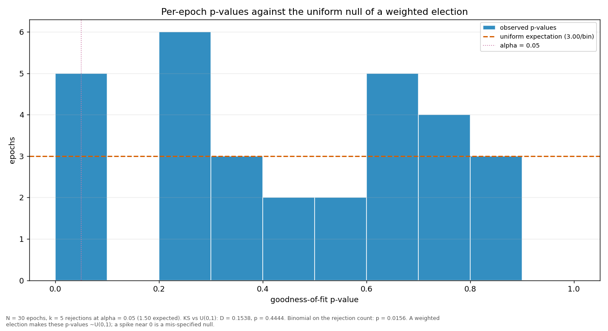

# Streaks and repeats

> Does a validator win more consecutive rounds, or repeat more often, than a weighted draw would produce? Both are compared against a Monte-Carlo reference built from the same weights the election used.

| epoch | L_max obs | L_max MC mean | p | repeat obs | repeat MC mean | p |
|---|---:|---:|---:|---:|---:|---:|
| 2 | 4 | 3.83 | 0.5921 | 0.2828 | 0.2170 | 0.0761 |
| 3 | 3 | 3.71 | 0.9797 | 0.2424 | 0.2086 | 0.2328 |
| 4 | 4 | 4.14 | 0.7172 | 0.2222 | 0.2421 | 0.7113 |
| 5 | 9 | 4.48 | 0.0077 | 0.3030 | 0.2521 | 0.1580 |
| 6 | 5 | 4.35 | 0.3631 | 0.3131 | 0.2600 | 0.1460 |
| 7 | 4 | 4.21 | 0.7381 | 0.2929 | 0.2418 | 0.1499 |
| 8 | 5 | 4.24 | 0.3236 | 0.2525 | 0.2542 | 0.5465 |
| 9 | 3 | 4.31 | 0.9970 | 0.1414 | 0.2511 | 0.9965 |
| 10 | 4 | 4.10 | 0.6945 | 0.2525 | 0.2314 | 0.3483 |
| 11 | 5 | 4.21 | 0.3157 | 0.3232 | 0.2397 | 0.0423 |
| 12 | 4 | 4.36 | 0.7882 | 0.2626 | 0.2570 | 0.4821 |
| 13 | 4 | 4.50 | 0.8072 | 0.2222 | 0.2489 | 0.7523 |
| 14 | 3 | 3.87 | 0.9860 | 0.1919 | 0.2193 | 0.7755 |
| 15 | 7 | 4.04 | 0.0217 | 0.3030 | 0.2347 | 0.0770 |
| 16 | 6 | 3.92 | 0.0608 | 0.2222 | 0.2241 | 0.5540 |
| 17 | 4 | 3.97 | 0.6490 | 0.2323 | 0.2277 | 0.5004 |
| 18 | 4 | 4.14 | 0.7151 | 0.2020 | 0.2412 | 0.8451 |
| 19 | 3 | 4.02 | 0.9923 | 0.2222 | 0.2288 | 0.5979 |
| 20 | 7 | 4.22 | 0.0351 | 0.2929 | 0.2422 | 0.1516 |
| 21 | 4 | 4.25 | 0.7513 | 0.1919 | 0.2420 | 0.8987 |
| 22 | 3 | 4.78 | 0.9982 | 0.2525 | 0.2564 | 0.5609 |
| 23 | 4 | 3.95 | 0.6364 | 0.2929 | 0.2234 | 0.0683 |
| 24 | 3 | 3.78 | 0.9829 | 0.2121 | 0.2147 | 0.5629 |
| 25 | 7 | 5.60 | 0.2394 | 0.3434 | 0.2925 | 0.1853 |
| 26 | 3 | 4.98 | 0.9991 | 0.2424 | 0.2743 | 0.7744 |
| 27 | 3 | 4.19 | 0.9967 | 0.2626 | 0.2469 | 0.3926 |
| 28 | 4 | 3.95 | 0.6355 | 0.1919 | 0.2209 | 0.7881 |
| 29 | 5 | 4.11 | 0.2783 | 0.2424 | 0.2323 | 0.4429 |
| 30 | 4 | 4.38 | 0.7771 | 0.2525 | 0.2464 | 0.4758 |
| 31 | 3 | 2.94 | 0.6408 | 0.2000 | 0.2391 | 0.7311 |
| all | 9 | 7.44 | 0.1770 | 0.2487 | 0.2403 | 0.1561 |

