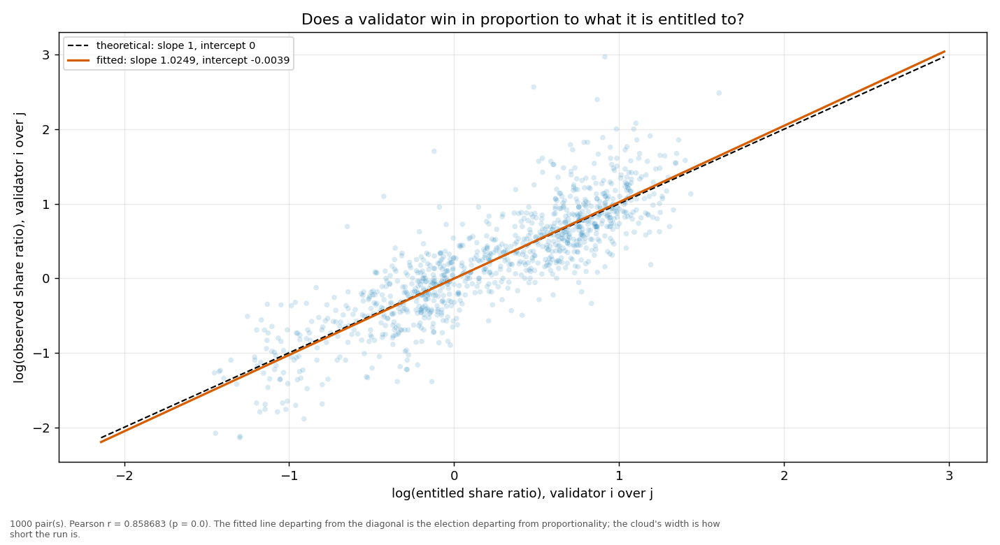
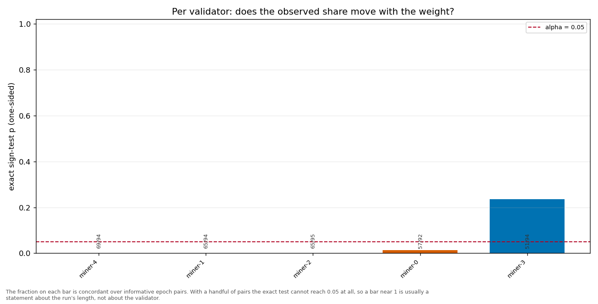

# Longitudinal behaviour

> Across epochs rather than within one: does a validator's share move with its weight, and does it move in proportion?

- **GLM logit on log(weight)**: beta1 = 1.1464 (95% CI [1.0894, 1.2033], n = 500, converged = True). H0 of weighted sortition is beta1 = 1 — NOT consistent.
- **Pairwise log-ratio regression**: slope = 1.0249, intercept = -0.0039, Pearson r = 0.8587 (p = 0.0000), n = 1000 pairs. Proportional selection implies slope 1 and intercept 0.
- **Sign test (weight ↔ share monotonicity)**: 5 validator(s) tested; p-values 0.2352, 0.0002, 0.0140, 0.0000, 0.0001.

