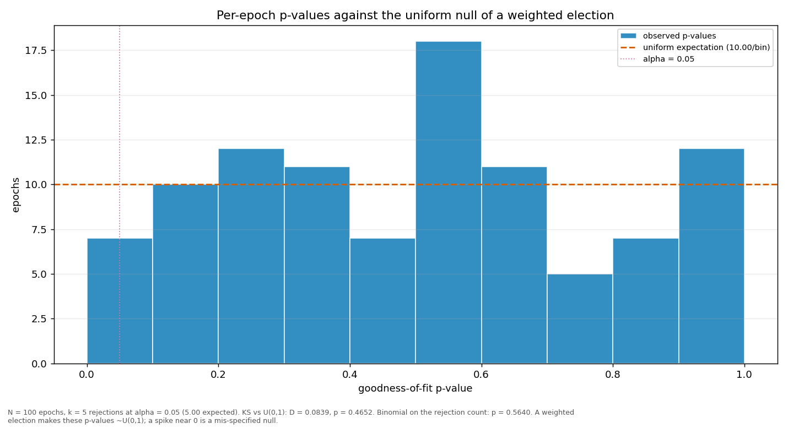

# Streaks and repeats

> Does a validator win more consecutive rounds, or repeat more often, than a weighted draw would produce? Both are compared against a Monte-Carlo reference built from the same weights the election used.

| epoch | L_max obs | L_max MC mean | p | repeat obs | repeat MC mean | p |
|---|---:|---:|---:|---:|---:|---:|
| 2 | 4 | 3.86 | 0.6035 | 0.2323 | 0.2183 | 0.4032 |
| 3 | 4 | 3.86 | 0.6028 | 0.2121 | 0.2190 | 0.6056 |
| 4 | 4 | 4.14 | 0.7188 | 0.3131 | 0.2382 | 0.0589 |
| 5 | 4 | 4.18 | 0.7280 | 0.1515 | 0.2390 | 0.9868 |
| 6 | 5 | 4.16 | 0.2919 | 0.2828 | 0.2413 | 0.1976 |
| 7 | 5 | 3.98 | 0.2345 | 0.2626 | 0.2257 | 0.2255 |
| 8 | 6 | 4.12 | 0.0907 | 0.2727 | 0.2404 | 0.2587 |
| 9 | 3 | 4.07 | 0.9929 | 0.1616 | 0.2327 | 0.9664 |
| 10 | 5 | 3.95 | 0.2262 | 0.2727 | 0.2238 | 0.1498 |
| 11 | 4 | 4.00 | 0.6604 | 0.1717 | 0.2276 | 0.9279 |
| 12 | 4 | 4.20 | 0.7397 | 0.2121 | 0.2431 | 0.7971 |
| 13 | 3 | 4.07 | 0.9921 | 0.2323 | 0.2287 | 0.5001 |
| 14 | 3 | 3.86 | 0.9848 | 0.2424 | 0.2190 | 0.3235 |
| 15 | 4 | 3.96 | 0.6527 | 0.2727 | 0.2284 | 0.1767 |
| 16 | 4 | 3.92 | 0.6377 | 0.2626 | 0.2256 | 0.2227 |
| 17 | 3 | 3.96 | 0.9900 | 0.2020 | 0.2250 | 0.7384 |
| 18 | 4 | 3.98 | 0.6626 | 0.2222 | 0.2289 | 0.5964 |
| 19 | 3 | 3.95 | 0.9909 | 0.2525 | 0.2270 | 0.3047 |
| 20 | 4 | 4.01 | 0.6662 | 0.2424 | 0.2280 | 0.4008 |
| 21 | 4 | 4.07 | 0.6873 | 0.2626 | 0.2320 | 0.2711 |
| 22 | 5 | 4.21 | 0.3192 | 0.2323 | 0.2325 | 0.5422 |
| 23 | 4 | 3.92 | 0.6276 | 0.2020 | 0.2222 | 0.7209 |
| 24 | 4 | 3.80 | 0.5817 | 0.2424 | 0.2158 | 0.2951 |
| 25 | 5 | 4.45 | 0.3940 | 0.1818 | 0.2444 | 0.9398 |
| 26 | 6 | 4.36 | 0.1426 | 0.3131 | 0.2482 | 0.0933 |
| 27 | 5 | 4.15 | 0.2936 | 0.3232 | 0.2407 | 0.0463 |
| 28 | 3 | 3.88 | 0.9876 | 0.1919 | 0.2202 | 0.7825 |
| 29 | 3 | 4.22 | 0.9952 | 0.1818 | 0.2374 | 0.9221 |
| 30 | 5 | 4.07 | 0.2672 | 0.2323 | 0.2312 | 0.5269 |
| 31 | 4 | 4.06 | 0.6853 | 0.2626 | 0.2318 | 0.2701 |
| 32 | 4 | 4.32 | 0.7541 | 0.2424 | 0.2396 | 0.5097 |
| 33 | 4 | 3.89 | 0.6143 | 0.2121 | 0.2199 | 0.6047 |
| 34 | 4 | 4.01 | 0.6632 | 0.2525 | 0.2274 | 0.3111 |
| 35 | 3 | 3.96 | 0.9894 | 0.2121 | 0.2245 | 0.6496 |
| 36 | 3 | 3.96 | 0.9902 | 0.2424 | 0.2279 | 0.4020 |
| 37 | 4 | 3.89 | 0.6143 | 0.1818 | 0.2213 | 0.8556 |
| 38 | 3 | 4.03 | 0.9919 | 0.1818 | 0.2293 | 0.8914 |
| 39 | 4 | 3.94 | 0.6427 | 0.2222 | 0.2260 | 0.5719 |
| 40 | 5 | 3.81 | 0.1828 | 0.2121 | 0.2150 | 0.5637 |
| 41 | 3 | 3.99 | 0.9905 | 0.1919 | 0.2274 | 0.8296 |
| 42 | 2 | 4.11 | 1.0000 | 0.1717 | 0.2348 | 0.9455 |
| 43 | 5 | 4.17 | 0.2994 | 0.2525 | 0.2403 | 0.4280 |
| 44 | 4 | 4.01 | 0.6751 | 0.1717 | 0.2324 | 0.9429 |
| 45 | 2 | 3.90 | 1.0000 | 0.1414 | 0.2215 | 0.9819 |
| 46 | 4 | 4.10 | 0.7078 | 0.2121 | 0.2370 | 0.7492 |
| 47 | 3 | 4.18 | 0.9941 | 0.2323 | 0.2367 | 0.5739 |
| 48 | 4 | 3.86 | 0.6037 | 0.2222 | 0.2193 | 0.5108 |
| 49 | 4 | 3.89 | 0.6128 | 0.1919 | 0.2184 | 0.7667 |
| 50 | 5 | 3.89 | 0.2066 | 0.2424 | 0.2211 | 0.3399 |
| 51 | 5 | 4.08 | 0.2697 | 0.2525 | 0.2367 | 0.3900 |
| 52 | 5 | 4.01 | 0.2473 | 0.2020 | 0.2282 | 0.7645 |
| 53 | 3 | 3.92 | 0.9881 | 0.2222 | 0.2228 | 0.5444 |
| 54 | 5 | 4.17 | 0.3047 | 0.2929 | 0.2419 | 0.1476 |
| 55 | 2 | 4.22 | 1.0000 | 0.1717 | 0.2485 | 0.9735 |
| 56 | 6 | 3.94 | 0.0663 | 0.2424 | 0.2223 | 0.3470 |
| 57 | 3 | 4.27 | 0.9954 | 0.2626 | 0.2376 | 0.3208 |
| 58 | 9 | 3.77 | 0.0007 | 0.1818 | 0.2120 | 0.8006 |
| 59 | 2 | 3.99 | 1.0000 | 0.1224 | 0.2277 | 0.9977 |
| 60 | 3 | 4.05 | 0.9923 | 0.1212 | 0.2292 | 0.9969 |
| 61 | 5 | 3.89 | 0.2047 | 0.1616 | 0.2210 | 0.9433 |
| 62 | 8 | 4.09 | 0.0075 | 0.3232 | 0.2327 | 0.0290 |
| 63 | 3 | 4.15 | 0.9945 | 0.2626 | 0.2359 | 0.3040 |
| 64 | 4 | 4.00 | 0.6611 | 0.2222 | 0.2279 | 0.5894 |
| 65 | 3 | 3.94 | 0.9895 | 0.3232 | 0.2254 | 0.0202 |
| 66 | 3 | 4.03 | 0.9920 | 0.2323 | 0.2279 | 0.4999 |
| 67 | 2 | 4.03 | 1.0000 | 0.1414 | 0.2297 | 0.9896 |
| 68 | 5 | 4.04 | 0.2541 | 0.2424 | 0.2297 | 0.4135 |
| 69 | 4 | 3.98 | 0.6502 | 0.1939 | 0.2252 | 0.8024 |
| 70 | 3 | 3.94 | 0.9896 | 0.1919 | 0.2264 | 0.8249 |
| 71 | 4 | 4.43 | 0.7985 | 0.2626 | 0.2554 | 0.4712 |
| 72 | 3 | 3.96 | 0.9894 | 0.1717 | 0.2253 | 0.9223 |
| 73 | 5 | 4.13 | 0.2842 | 0.2449 | 0.2332 | 0.4295 |
| 74 | 6 | 3.96 | 0.0680 | 0.3061 | 0.2264 | 0.0446 |
| 75 | 4 | 3.89 | 0.6164 | 0.2626 | 0.2212 | 0.1885 |
| 76 | 3 | 4.03 | 0.9917 | 0.2143 | 0.2299 | 0.6736 |
| 77 | 5 | 4.00 | 0.2415 | 0.3232 | 0.2273 | 0.0240 |
| 78 | 6 | 4.12 | 0.0928 | 0.2525 | 0.2403 | 0.4251 |
| 79 | 2 | 4.01 | 1.0000 | 0.1531 | 0.2340 | 0.9832 |
| 80 | 5 | 3.97 | 0.2339 | 0.2525 | 0.2286 | 0.3220 |
| 81 | 4 | 3.87 | 0.6065 | 0.2959 | 0.2194 | 0.0518 |
| 82 | 5 | 3.96 | 0.2336 | 0.2245 | 0.2220 | 0.5120 |
| 83 | 6 | 4.01 | 0.0776 | 0.2245 | 0.2264 | 0.5505 |
| 84 | 4 | 4.01 | 0.6621 | 0.2323 | 0.2273 | 0.4903 |
| 85 | 3 | 4.06 | 0.9924 | 0.2121 | 0.2306 | 0.6969 |
| 86 | 4 | 3.93 | 0.6305 | 0.2121 | 0.2231 | 0.6437 |
| 87 | 5 | 3.94 | 0.2220 | 0.2424 | 0.2258 | 0.3809 |
| 88 | 3 | 4.05 | 0.9936 | 0.2020 | 0.2350 | 0.8063 |
| 89 | 3 | 4.06 | 0.9924 | 0.2653 | 0.2325 | 0.2555 |
| 90 | 3 | 3.94 | 0.9889 | 0.2959 | 0.2242 | 0.0623 |
| 91 | 3 | 4.07 | 0.9929 | 0.2062 | 0.2383 | 0.8017 |
| 92 | 3 | 3.85 | 0.9857 | 0.2143 | 0.2192 | 0.5864 |
| 93 | 4 | 3.96 | 0.6362 | 0.2653 | 0.2249 | 0.2012 |
| 94 | 4 | 3.92 | 0.6252 | 0.2143 | 0.2227 | 0.6149 |
| 95 | 4 | 3.94 | 0.6321 | 0.2245 | 0.2231 | 0.5264 |
| 96 | 3 | 3.98 | 0.9896 | 0.1856 | 0.2289 | 0.8745 |
| 97 | 3 | 3.97 | 0.9904 | 0.1919 | 0.2254 | 0.8193 |
| 98 | 4 | 3.94 | 0.6318 | 0.2474 | 0.2242 | 0.3256 |
| 99 | 7 | 3.93 | 0.0191 | 0.2551 | 0.2240 | 0.2639 |
| 100 | 5 | 4.15 | 0.3034 | 0.2165 | 0.2332 | 0.6839 |
| 101 | 2 | 2.97 | 0.9940 | 0.1000 | 0.2410 | 0.9676 |
| all | 9 | 7.69 | 0.1880 | 0.2265 | 0.2289 | 0.7045 |

