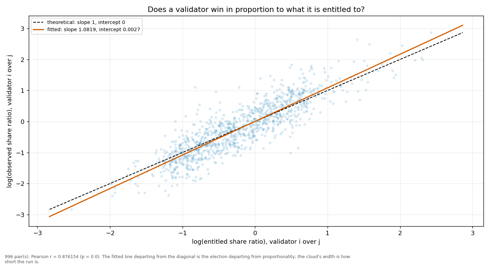
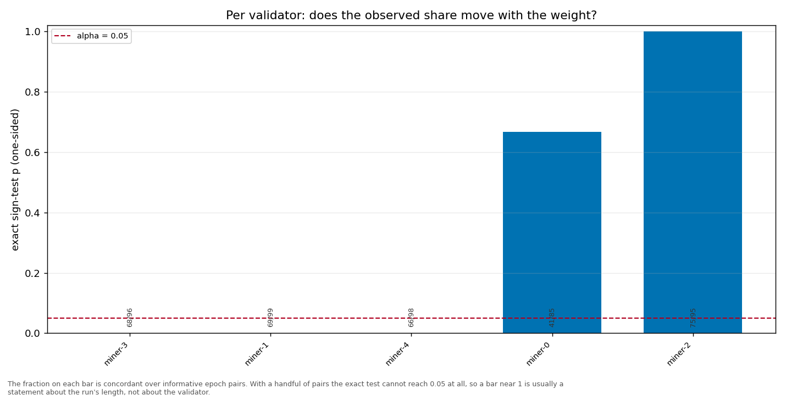

# Longitudinal behaviour

> Across epochs rather than within one: does a validator's share move with its weight, and does it move in proportion?

- **GLM logit on log(weight)**: beta1 = 1.1633 (95% CI [1.1133, 1.2132], n = 499, converged = True). H0 of weighted sortition is beta1 = 1 — NOT consistent.
- **Pairwise log-ratio regression**: slope = 1.0819, intercept = 0.0027, Pearson r = 0.8762 (p = 0.0000), n = 996 pairs. Proportional selection implies slope 1 and intercept 0.
- **Sign test (weight ↔ share monotonicity)**: 5 validator(s) tested; p-values 0.6677, 0.0004, 0.0000, 0.0001, 0.0000.

