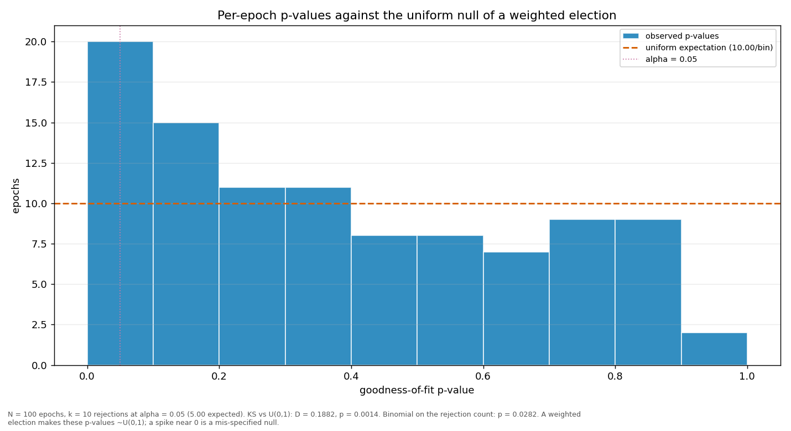

# Streaks and repeats

> Does a validator win more consecutive rounds, or repeat more often, than a weighted draw would produce? Both are compared against a Monte-Carlo reference built from the same weights the election used.

| epoch | L_max obs | L_max MC mean | p | repeat obs | repeat MC mean | p |
|---|---:|---:|---:|---:|---:|---:|
| 2 | 4 | 3.81 | 0.5786 | 0.3131 | 0.2167 | 0.0182 |
| 3 | 4 | 3.81 | 0.5807 | 0.3030 | 0.2170 | 0.0297 |
| 4 | 6 | 4.09 | 0.0855 | 0.3535 | 0.2367 | 0.0093 |
| 5 | 10 | 4.07 | 0.0009 | 0.4242 | 0.2335 | 0.0002 |
| 6 | 6 | 4.08 | 0.0827 | 0.3838 | 0.2358 | 0.0013 |
| 7 | 12 | 3.95 | 0.0001 | 0.3434 | 0.2258 | 0.0069 |
| 8 | 3 | 4.08 | 0.9932 | 0.2828 | 0.2376 | 0.1765 |
| 9 | 4 | 4.00 | 0.6637 | 0.3131 | 0.2284 | 0.0357 |
| 10 | 4 | 3.91 | 0.6202 | 0.2929 | 0.2210 | 0.0629 |
| 11 | 5 | 3.95 | 0.2327 | 0.2828 | 0.2254 | 0.1150 |
| 12 | 5 | 4.18 | 0.3114 | 0.4545 | 0.2393 | 0.0001 |
| 13 | 9 | 4.02 | 0.0023 | 0.4949 | 0.2252 | 0.0001 |
| 14 | 4 | 3.84 | 0.5922 | 0.2525 | 0.2182 | 0.2353 |
| 15 | 4 | 3.95 | 0.6464 | 0.3131 | 0.2277 | 0.0331 |
| 16 | 4 | 3.87 | 0.6082 | 0.3131 | 0.2214 | 0.0253 |
| 17 | 6 | 3.92 | 0.0594 | 0.3535 | 0.2247 | 0.0034 |
| 18 | 5 | 3.91 | 0.2132 | 0.2525 | 0.2241 | 0.2832 |
| 19 | 4 | 3.84 | 0.5959 | 0.3232 | 0.2205 | 0.0141 |
| 20 | 6 | 3.93 | 0.0619 | 0.2626 | 0.2252 | 0.2236 |
| 21 | 7 | 7.15 | 0.5533 | 0.4545 | 0.3639 | 0.0698 |
| 22 | 5 | 3.76 | 0.1715 | 0.3232 | 0.2097 | 0.0074 |
| 23 | 4 | 3.91 | 0.6227 | 0.3636 | 0.2225 | 0.0015 |
| 24 | 4 | 5.13 | 0.9001 | 0.3838 | 0.2720 | 0.0191 |
| 25 | 5 | 4.06 | 0.2707 | 0.3131 | 0.2320 | 0.0427 |
| 26 | 10 | 6.75 | 0.0934 | 0.4747 | 0.3515 | 0.0213 |
| 27 | 10 | 5.23 | 0.0174 | 0.4343 | 0.2873 | 0.0033 |
| 28 | 3 | 3.85 | 0.9849 | 0.3333 | 0.2165 | 0.0060 |
| 29 | 5 | 4.52 | 0.4357 | 0.3737 | 0.2709 | 0.0225 |
| 30 | 5 | 4.42 | 0.3929 | 0.3333 | 0.2629 | 0.0830 |
| 31 | 5 | 4.49 | 0.4164 | 0.3232 | 0.2594 | 0.0994 |
| 32 | 6 | 4.86 | 0.2520 | 0.3737 | 0.2668 | 0.0204 |
| 33 | 4 | 3.99 | 0.6572 | 0.3333 | 0.2293 | 0.0142 |
| 34 | 5 | 4.17 | 0.3107 | 0.3535 | 0.2371 | 0.0079 |
| 35 | 7 | 4.67 | 0.0843 | 0.3939 | 0.2583 | 0.0042 |
| 36 | 5 | 3.98 | 0.2405 | 0.3535 | 0.2229 | 0.0031 |
| 37 | 13 | 5.29 | 0.0015 | 0.4949 | 0.2829 | 0.0001 |
| 38 | 4 | 4.17 | 0.7152 | 0.3434 | 0.2337 | 0.0100 |
| 39 | 6 | 4.46 | 0.1661 | 0.3131 | 0.2471 | 0.0904 |
| 40 | 5 | 4.02 | 0.2523 | 0.3232 | 0.2224 | 0.0176 |
| 41 | 4 | 4.13 | 0.6926 | 0.3535 | 0.2291 | 0.0052 |
| 42 | 6 | 4.60 | 0.1917 | 0.3939 | 0.2628 | 0.0061 |
| 43 | 6 | 4.60 | 0.1905 | 0.3838 | 0.2631 | 0.0094 |
| 44 | 7 | 5.33 | 0.1923 | 0.3030 | 0.2837 | 0.3775 |
| 45 | 5 | 4.08 | 0.2737 | 0.2828 | 0.2295 | 0.1332 |
| 46 | 6 | 5.51 | 0.4168 | 0.4949 | 0.3117 | 0.0005 |
| 47 | 6 | 4.60 | 0.2009 | 0.3535 | 0.2498 | 0.0186 |
| 48 | 4 | 4.41 | 0.8108 | 0.3838 | 0.2705 | 0.0100 |
| 49 | 7 | 4.37 | 0.0482 | 0.3939 | 0.2493 | 0.0019 |
| 50 | 4 | 4.23 | 0.7351 | 0.3131 | 0.2382 | 0.0646 |
| 51 | 5 | 4.55 | 0.4384 | 0.3232 | 0.2603 | 0.1078 |
| 52 | 5 | 4.37 | 0.3699 | 0.3535 | 0.2507 | 0.0179 |
| 53 | 4 | 4.34 | 0.7725 | 0.4242 | 0.2468 | 0.0003 |
| 54 | 5 | 4.40 | 0.3860 | 0.3434 | 0.2423 | 0.0190 |
| 55 | 9 | 5.79 | 0.0723 | 0.5152 | 0.3111 | 0.0002 |
| 56 | 7 | 4.42 | 0.0548 | 0.4343 | 0.2477 | 0.0005 |
| 57 | 6 | 4.99 | 0.2862 | 0.4141 | 0.2749 | 0.0043 |
| 58 | 5 | 3.87 | 0.2011 | 0.3030 | 0.2197 | 0.0350 |
| 59 | 4 | 4.56 | 0.8279 | 0.2929 | 0.2592 | 0.2622 |
| 60 | 8 | 5.23 | 0.0722 | 0.3939 | 0.2998 | 0.0430 |
| 61 | 7 | 4.14 | 0.0357 | 0.4141 | 0.2276 | 0.0001 |
| 62 | 6 | 4.05 | 0.0854 | 0.4040 | 0.2268 | 0.0004 |
| 63 | 5 | 4.16 | 0.3034 | 0.3571 | 0.2351 | 0.0063 |
| 64 | 6 | 3.88 | 0.0547 | 0.3636 | 0.2224 | 0.0020 |
| 65 | 5 | 4.04 | 0.2600 | 0.3776 | 0.2332 | 0.0013 |
| 66 | 5 | 4.05 | 0.2662 | 0.4343 | 0.2269 | 0.0001 |
| 67 | 5 | 4.13 | 0.2904 | 0.4343 | 0.2338 | 0.0002 |
| 68 | 3 | 3.98 | 0.9884 | 0.3367 | 0.2259 | 0.0101 |
| 69 | 5 | 4.09 | 0.2787 | 0.4747 | 0.2311 | 0.0001 |
| 70 | 6 | 3.98 | 0.0695 | 0.3333 | 0.2268 | 0.0112 |
| 71 | 6 | 4.07 | 0.0788 | 0.3939 | 0.2353 | 0.0008 |
| 72 | 3 | 3.81 | 0.9848 | 0.2626 | 0.2156 | 0.1516 |
| 73 | 6 | 3.97 | 0.0728 | 0.3030 | 0.2243 | 0.0447 |
| 74 | 6 | 3.98 | 0.0710 | 0.3469 | 0.2261 | 0.0060 |
| 75 | 6 | 3.93 | 0.0620 | 0.3878 | 0.2252 | 0.0008 |
| 76 | 7 | 4.03 | 0.0214 | 0.4388 | 0.2312 | 0.0002 |
| 77 | 5 | 3.97 | 0.2381 | 0.3571 | 0.2266 | 0.0035 |
| 78 | 5 | 4.00 | 0.2487 | 0.3980 | 0.2320 | 0.0002 |
| 79 | 9 | 3.98 | 0.0013 | 0.3636 | 0.2306 | 0.0035 |
| 80 | 4 | 3.92 | 0.6293 | 0.3673 | 0.2246 | 0.0018 |
| 81 | 5 | 3.87 | 0.2003 | 0.3939 | 0.2200 | 0.0003 |
| 82 | 5 | 3.91 | 0.2199 | 0.3878 | 0.2214 | 0.0005 |
| 83 | 4 | 4.00 | 0.6581 | 0.3367 | 0.2260 | 0.0096 |
| 84 | 4 | 3.90 | 0.6219 | 0.2828 | 0.2217 | 0.0948 |
| 85 | 5 | 3.99 | 0.2415 | 0.3980 | 0.2274 | 0.0004 |
| 86 | 5 | 3.86 | 0.1980 | 0.4040 | 0.2190 | 0.0001 |
| 87 | 6 | 3.92 | 0.0597 | 0.3163 | 0.2254 | 0.0264 |
| 88 | 5 | 3.93 | 0.2230 | 0.2424 | 0.2251 | 0.3765 |
| 89 | 3 | 3.86 | 0.9876 | 0.3636 | 0.2222 | 0.0022 |
| 90 | 5 | 3.97 | 0.2317 | 0.3535 | 0.2257 | 0.0034 |
| 91 | 4 | 4.04 | 0.6803 | 0.3469 | 0.2328 | 0.0087 |
| 92 | 6 | 3.98 | 0.0708 | 0.3265 | 0.2275 | 0.0203 |
| 93 | 5 | 3.78 | 0.1767 | 0.2959 | 0.2148 | 0.0394 |
| 94 | 6 | 3.88 | 0.0591 | 0.3939 | 0.2194 | 0.0002 |
| 95 | 4 | 3.98 | 0.6558 | 0.3265 | 0.2282 | 0.0188 |
| 96 | 5 | 3.96 | 0.2356 | 0.2857 | 0.2285 | 0.1163 |
| 97 | 7 | 3.93 | 0.0185 | 0.3737 | 0.2222 | 0.0011 |
| 98 | 4 | 3.79 | 0.5723 | 0.2857 | 0.2143 | 0.0582 |
| 99 | 5 | 3.85 | 0.1975 | 0.3980 | 0.2196 | 0.0001 |
| 100 | 5 | 4.09 | 0.2799 | 0.4388 | 0.2311 | 0.0001 |
| 101 | 4 | 2.92 | 0.2135 | 0.4737 | 0.2390 | 0.0278 |
| all | 13 | 9.39 | 0.0581 | 0.3607 | 0.2384 | 0.0001 |

