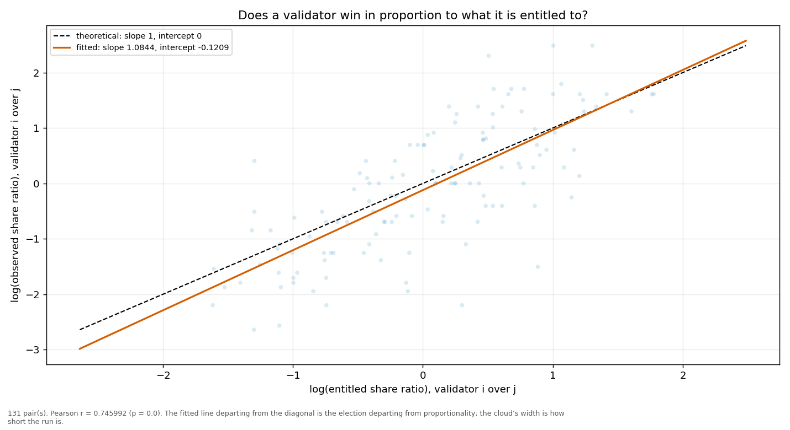
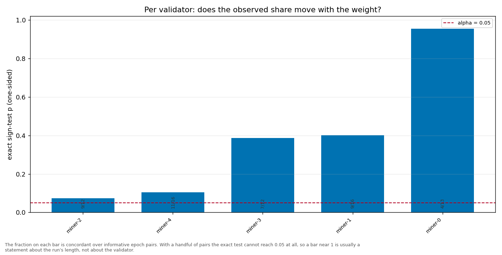

# Longitudinal behaviour

> Across epochs rather than within one: does a validator's share move with its weight, and does it move in proportion?

- **GLM logit on log(weight)**: beta1 = 0.9971 (95% CI [0.8242, 1.1699], n = 83, converged = True). H0 of weighted sortition is beta1 = 1 — consistent.
- **Pairwise log-ratio regression**: slope = 1.0844, intercept = -0.1209, Pearson r = 0.7460 (p = 0.0000), n = 131 pairs. Proportional selection implies slope 1 and intercept 0.
- **Sign test (weight ↔ share monotonicity)**: 5 validator(s) tested; p-values 0.0730, 0.4018, 0.3872, 0.9539, 0.1051.

