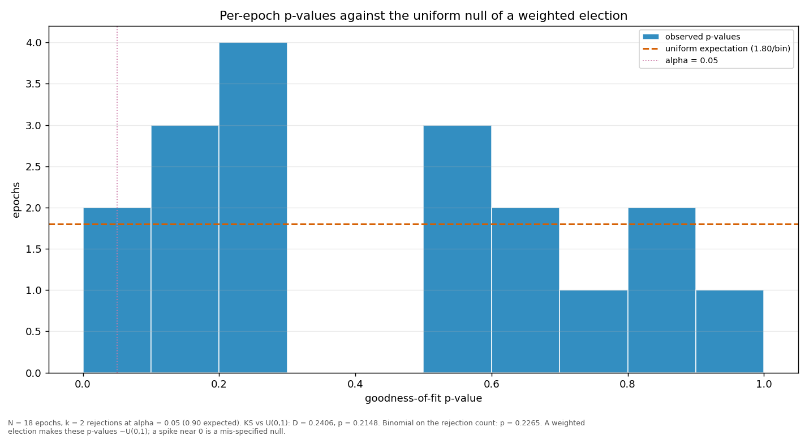

# Streaks and repeats

> Does a validator win more consecutive rounds, or repeat more often, than a weighted draw would produce? Both are compared against a Monte-Carlo reference built from the same weights the election used.

| epoch | L_max obs | L_max MC mean | p | repeat obs | repeat MC mean | p |
|---|---:|---:|---:|---:|---:|---:|
| 4 | 4 | 2.91 | 0.1953 | 0.2917 | 0.2209 | 0.2689 |
| 5 | 4 | 3.66 | 0.4575 | 0.4583 | 0.2918 | 0.0778 |
| 6 | 4 | 3.89 | 0.5360 | 0.4583 | 0.3126 | 0.1163 |
| 7 | 3 | 4.05 | 0.9011 | 0.4167 | 0.3205 | 0.2317 |
| 8 | 6 | 4.02 | 0.1499 | 0.5000 | 0.3037 | 0.0525 |
| 9 | 4 | 4.02 | 0.5800 | 0.2917 | 0.3346 | 0.7246 |
| 10 | 8 | 4.36 | 0.0548 | 0.6250 | 0.3535 | 0.0118 |
| 11 | 5 | 4.20 | 0.3387 | 0.5417 | 0.3400 | 0.0475 |
| 12 | 3 | 4.25 | 0.9284 | 0.3750 | 0.3518 | 0.4755 |
| 13 | 5 | 3.38 | 0.1366 | 0.5000 | 0.2826 | 0.0239 |
| 14 | 4 | 4.30 | 0.6364 | 0.3750 | 0.3535 | 0.4832 |
| 15 | 4 | 3.47 | 0.4008 | 0.5417 | 0.2968 | 0.0128 |
| 16 | 4 | 3.08 | 0.2610 | 0.3333 | 0.2430 | 0.2106 |
| 17 | 7 | 2.96 | 0.0049 | 0.4583 | 0.2255 | 0.0125 |
| 18 | 4 | 3.22 | 0.3133 | 0.4583 | 0.2585 | 0.0304 |
| 19 | 5 | 3.10 | 0.0796 | 0.2917 | 0.2464 | 0.3756 |
| 20 | 6 | 3.41 | 0.0529 | 0.3750 | 0.2702 | 0.1917 |
| 21 | 5 | 3.52 | 0.1866 | 0.4000 | 0.2901 | 0.2181 |
| all | 8 | 7.31 | 0.3819 | 0.4289 | 0.2956 | 0.0001 |

