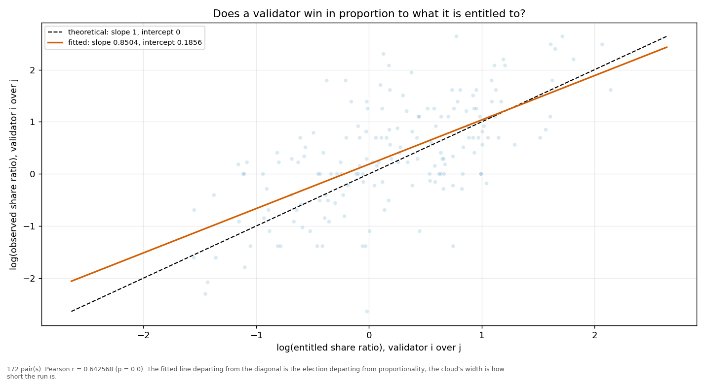
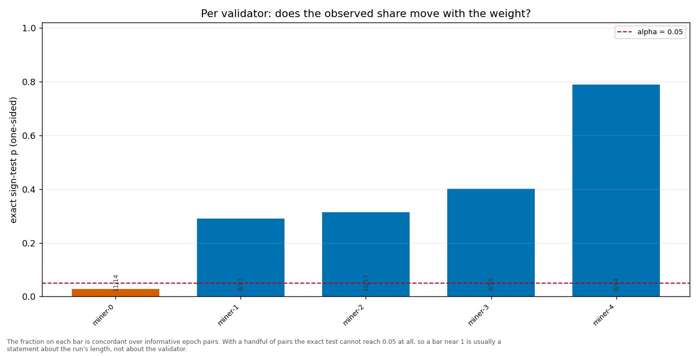

# Longitudinal behaviour

> Across epochs rather than within one: does a validator's share move with its weight, and does it move in proportion?

- **GLM logit on log(weight)**: beta1 = 0.7501 (95% CI [0.5684, 0.9318], n = 90, converged = True). H0 of weighted sortition is beta1 = 1 — NOT consistent.
- **Pairwise log-ratio regression**: slope = 0.8504, intercept = 0.1856, Pearson r = 0.6426 (p = 0.0000), n = 172 pairs. Proportional selection implies slope 1 and intercept 0.
- **Sign test (weight ↔ share monotonicity)**: 5 validator(s) tested; p-values 0.7880, 0.3145, 0.0287, 0.4018, 0.2905.

