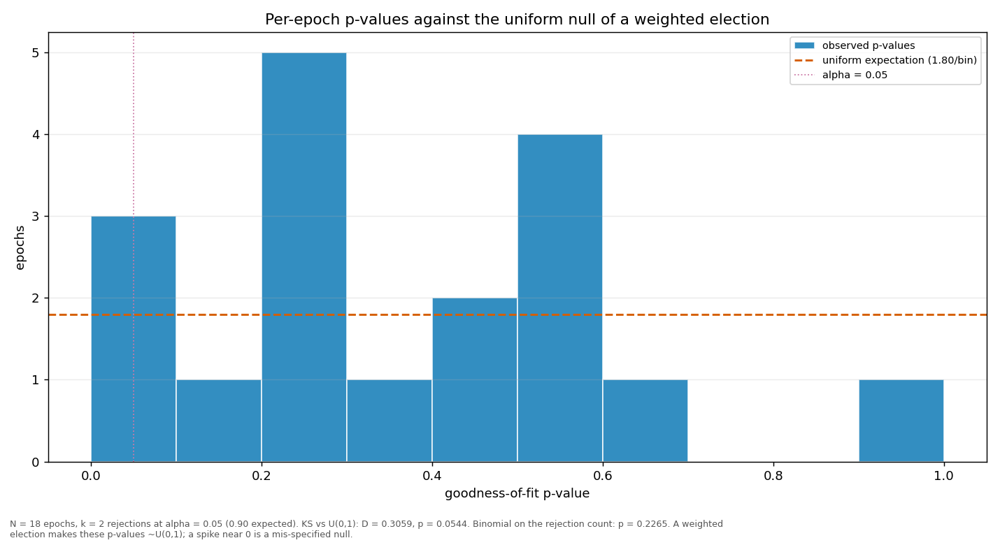

# Streaks and repeats

> Does a validator win more consecutive rounds, or repeat more often, than a weighted draw would produce? Both are compared against a Monte-Carlo reference built from the same weights the election used.

| epoch | L_max obs | L_max MC mean | p | repeat obs | repeat MC mean | p |
|---|---:|---:|---:|---:|---:|---:|
| 4 | 3 | 2.85 | 0.6113 | 0.2609 | 0.2183 | 0.3870 |
| 5 | 2 | 3.31 | 0.9992 | 0.0833 | 0.2580 | 0.9920 |
| 6 | 5 | 4.23 | 0.3469 | 0.5000 | 0.3301 | 0.0846 |
| 7 | 2 | 3.34 | 0.9990 | 0.2083 | 0.2573 | 0.7651 |
| 8 | 4 | 3.37 | 0.3645 | 0.3333 | 0.2713 | 0.3197 |
| 9 | 3 | 3.06 | 0.7042 | 0.2083 | 0.2378 | 0.7044 |
| 10 | 2 | 3.10 | 0.9984 | 0.2083 | 0.2446 | 0.7312 |
| 11 | 3 | 2.96 | 0.6679 | 0.1250 | 0.2281 | 0.9337 |
| 12 | 5 | 3.53 | 0.1759 | 0.3750 | 0.2762 | 0.2023 |
| 13 | 4 | 3.61 | 0.4464 | 0.4583 | 0.2848 | 0.0698 |
| 14 | 2 | 3.14 | 0.9981 | 0.1250 | 0.2453 | 0.9476 |
| 15 | 3 | 2.93 | 0.6501 | 0.2500 | 0.2237 | 0.4479 |
| 16 | 5 | 3.01 | 0.0661 | 0.3333 | 0.2370 | 0.1925 |
| 17 | 2 | 3.13 | 0.9986 | 0.1250 | 0.2445 | 0.9492 |
| 18 | 3 | 3.23 | 0.7662 | 0.2917 | 0.2593 | 0.4326 |
| 19 | 2 | 3.51 | 0.9987 | 0.1667 | 0.2799 | 0.9200 |
| 20 | 3 | 3.47 | 0.8216 | 0.2083 | 0.2829 | 0.8404 |
| 21 | 6 | 3.25 | 0.0482 | 0.3500 | 0.2655 | 0.2759 |
| all | 6 | 6.28 | 0.6681 | 0.2523 | 0.2594 | 0.6355 |

