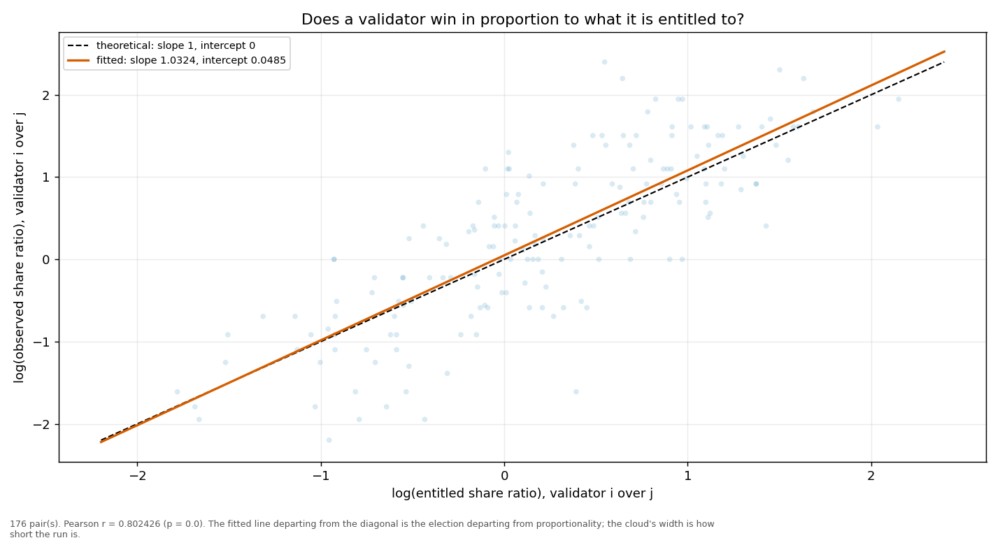
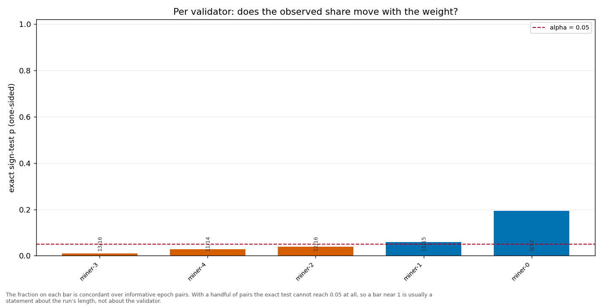

# Longitudinal behaviour

> Across epochs rather than within one: does a validator's share move with its weight, and does it move in proportion?

- **GLM logit on log(weight)**: beta1 = 0.9183 (95% CI [0.7303, 1.1064], n = 90, converged = True). H0 of weighted sortition is beta1 = 1 — consistent.
- **Pairwise log-ratio regression**: slope = 1.0324, intercept = 0.0485, Pearson r = 0.8024 (p = 0.0000), n = 176 pairs. Proportional selection implies slope 1 and intercept 0.
- **Sign test (weight ↔ share monotonicity)**: 5 validator(s) tested; p-values 0.0106, 0.0384, 0.0592, 0.1938, 0.0287.

