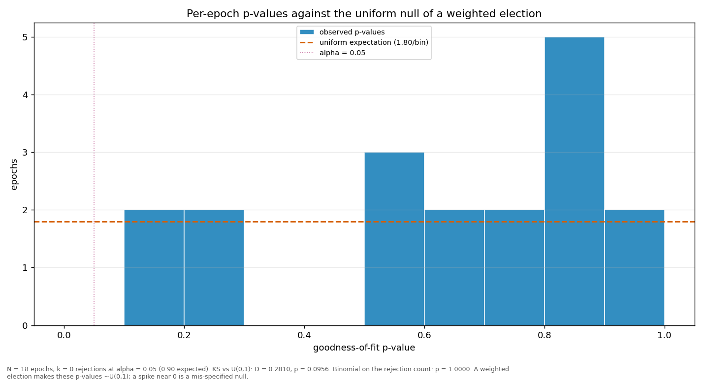

# Streaks and repeats

> Does a validator win more consecutive rounds, or repeat more often, than a weighted draw would produce? Both are compared against a Monte-Carlo reference built from the same weights the election used.

| epoch | L_max obs | L_max MC mean | p | repeat obs | repeat MC mean | p |
|---|---:|---:|---:|---:|---:|---:|
| 4 | 4 | 2.87 | 0.1857 | 0.2917 | 0.2174 | 0.2527 |
| 5 | 3 | 3.31 | 0.7657 | 0.2083 | 0.2572 | 0.7673 |
| 6 | 4 | 4.09 | 0.5793 | 0.3750 | 0.3228 | 0.3670 |
| 7 | 3 | 3.30 | 0.7632 | 0.2083 | 0.2546 | 0.7543 |
| 8 | 3 | 3.36 | 0.7975 | 0.1667 | 0.2697 | 0.9167 |
| 9 | 2 | 3.04 | 0.9985 | 0.1667 | 0.2360 | 0.8469 |
| 10 | 2 | 3.10 | 0.9985 | 0.1250 | 0.2456 | 0.9548 |
| 11 | 5 | 2.96 | 0.0597 | 0.3333 | 0.2282 | 0.1668 |
| 12 | 7 | 3.46 | 0.0263 | 0.4583 | 0.2718 | 0.0467 |
| 13 | 4 | 3.63 | 0.4450 | 0.3750 | 0.2857 | 0.2398 |
| 14 | 3 | 3.18 | 0.7367 | 0.2500 | 0.2494 | 0.5679 |
| 15 | 3 | 2.95 | 0.6579 | 0.2917 | 0.2244 | 0.2832 |
| 16 | 5 | 2.94 | 0.0528 | 0.2500 | 0.2312 | 0.4935 |
| 17 | 3 | 2.99 | 0.6696 | 0.2500 | 0.2305 | 0.4902 |
| 18 | 3 | 3.19 | 0.7520 | 0.1667 | 0.2546 | 0.8875 |
| 19 | 3 | 3.49 | 0.8134 | 0.3333 | 0.2782 | 0.3471 |
| 20 | 2 | 3.45 | 0.9994 | 0.2917 | 0.2811 | 0.5207 |
| 21 | 3 | 3.45 | 0.7768 | 0.1500 | 0.2854 | 0.9397 |
| all | 7 | 6.17 | 0.3275 | 0.2638 | 0.2577 | 0.4049 |

