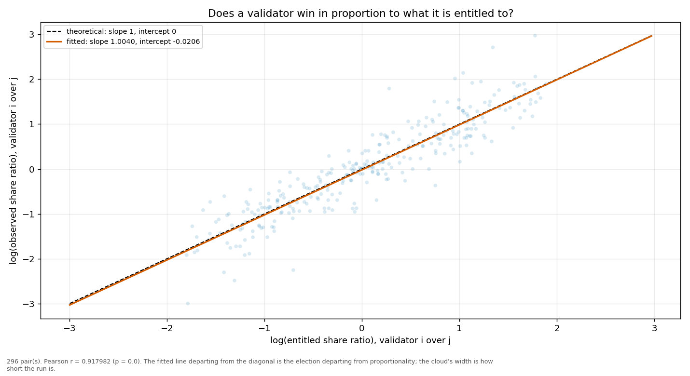
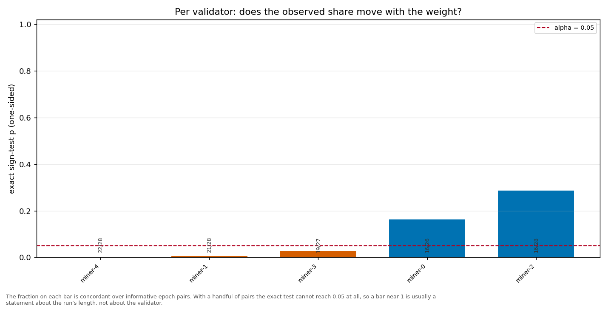

# Longitudinal behaviour

> Across epochs rather than within one: does a validator's share move with its weight, and does it move in proportion?

- **GLM logit on log(weight)**: beta1 = 1.0907 (95% CI [1.0156, 1.1657], n = 150, converged = True). H0 of weighted sortition is beta1 = 1 — NOT consistent.
- **Pairwise log-ratio regression**: slope = 1.0040, intercept = -0.0206, Pearson r = 0.9180 (p = 0.0000), n = 296 pairs. Proportional selection implies slope 1 and intercept 0.
- **Sign test (weight ↔ share monotonicity)**: 5 validator(s) tested; p-values 0.2858, 0.1635, 0.0261, 0.0019, 0.0063.

