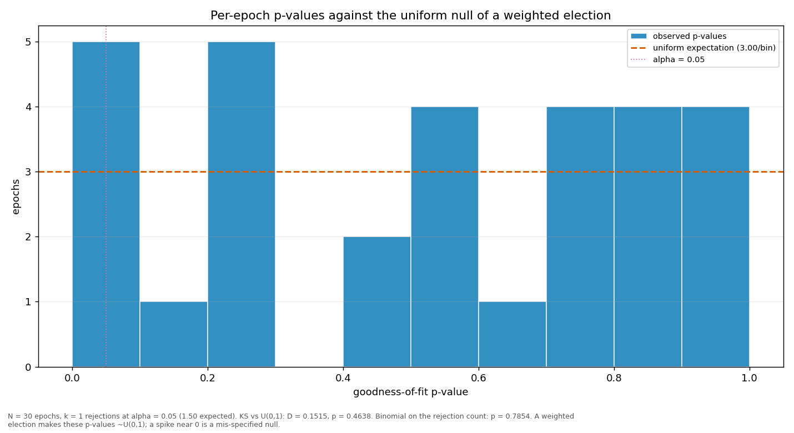

# Streaks and repeats

> Does a validator win more consecutive rounds, or repeat more often, than a weighted draw would produce? Both are compared against a Monte-Carlo reference built from the same weights the election used.

| epoch | L_max obs | L_max MC mean | p | repeat obs | repeat MC mean | p |
|---|---:|---:|---:|---:|---:|---:|
| 2 | 4 | 3.80 | 0.5834 | 0.2121 | 0.2160 | 0.5770 |
| 3 | 4 | 4.10 | 0.6898 | 0.2828 | 0.2294 | 0.1351 |
| 4 | 4 | 4.28 | 0.7711 | 0.2727 | 0.2543 | 0.3748 |
| 5 | 3 | 4.45 | 0.9976 | 0.2727 | 0.2629 | 0.4516 |
| 6 | 5 | 4.19 | 0.3099 | 0.2626 | 0.2461 | 0.3892 |
| 7 | 3 | 4.12 | 0.9948 | 0.1818 | 0.2407 | 0.9302 |
| 8 | 4 | 4.12 | 0.7177 | 0.2222 | 0.2417 | 0.7053 |
| 9 | 5 | 4.17 | 0.3052 | 0.3232 | 0.2451 | 0.0542 |
| 10 | 3 | 4.08 | 0.9917 | 0.2020 | 0.2307 | 0.7749 |
| 11 | 3 | 4.04 | 0.9924 | 0.1919 | 0.2317 | 0.8500 |
| 12 | 5 | 4.13 | 0.2897 | 0.2929 | 0.2399 | 0.1400 |
| 13 | 4 | 4.47 | 0.8174 | 0.2525 | 0.2584 | 0.5863 |
| 14 | 3 | 4.09 | 0.9924 | 0.2424 | 0.2307 | 0.4261 |
| 15 | 4 | 4.10 | 0.7091 | 0.2929 | 0.2393 | 0.1377 |
| 16 | 4 | 3.94 | 0.6347 | 0.2121 | 0.2242 | 0.6472 |
| 17 | 4 | 4.79 | 0.8681 | 0.2929 | 0.2676 | 0.3207 |
| 18 | 3 | 4.48 | 0.9985 | 0.2020 | 0.2655 | 0.9360 |
| 19 | 4 | 4.65 | 0.8501 | 0.2828 | 0.2680 | 0.4053 |
| 20 | 4 | 4.97 | 0.9200 | 0.2424 | 0.2965 | 0.8930 |
| 21 | 3 | 4.64 | 0.9994 | 0.2222 | 0.2755 | 0.8959 |
| 22 | 4 | 4.62 | 0.8540 | 0.2727 | 0.2715 | 0.5174 |
| 23 | 4 | 4.76 | 0.8743 | 0.2929 | 0.2751 | 0.3871 |
| 24 | 4 | 5.12 | 0.9151 | 0.3333 | 0.2807 | 0.1642 |
| 25 | 5 | 5.01 | 0.5987 | 0.3636 | 0.2980 | 0.1115 |
| 26 | 3 | 4.64 | 0.9990 | 0.2121 | 0.2760 | 0.9308 |
| 27 | 7 | 4.61 | 0.0680 | 0.3636 | 0.2748 | 0.0438 |
| 28 | 4 | 4.85 | 0.8867 | 0.2828 | 0.2756 | 0.4672 |
| 29 | 4 | 4.29 | 0.7729 | 0.2626 | 0.2540 | 0.4561 |
| 30 | 5 | 4.66 | 0.4737 | 0.2828 | 0.2688 | 0.4156 |
| 31 | 3 | 3.09 | 0.6977 | 0.3000 | 0.2588 | 0.4152 |
| all | 7 | 7.65 | 0.8381 | 0.2635 | 0.2565 | 0.2100 |

