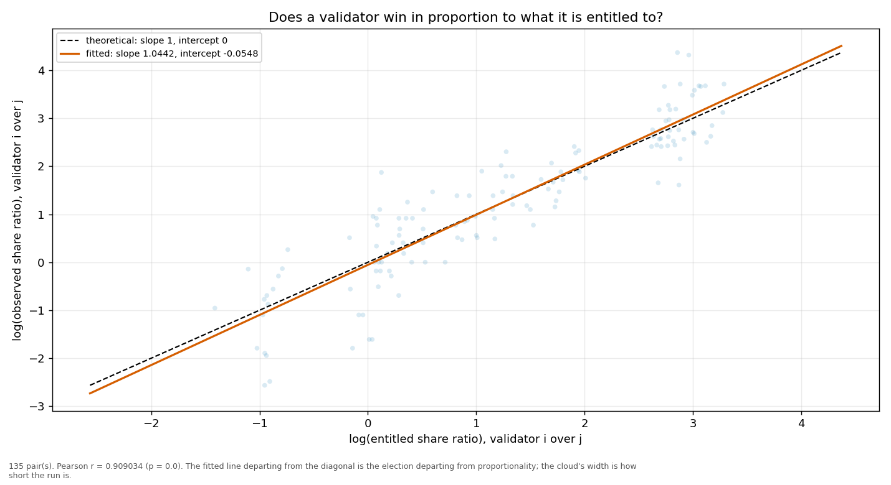
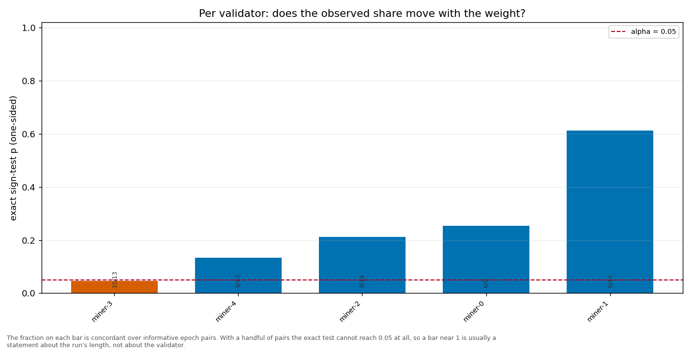

# Longitudinal behaviour

> Across epochs rather than within one: does a validator's share move with its weight, and does it move in proportion?

- **GLM logit on log(weight)**: beta1 = 1.4898 (95% CI [1.4239, 1.5556], n = 75, converged = True). H0 of weighted sortition is beta1 = 1 — NOT consistent.
- **Pairwise log-ratio regression**: slope = 1.0442, intercept = -0.0548, Pearson r = 0.9090 (p = 0.0000), n = 135 pairs. Proportional selection implies slope 1 and intercept 0.
- **Sign test (weight ↔ share monotonicity)**: 5 validator(s) tested; p-values 0.2120, 0.0461, 0.6128, 0.1334, 0.2539.

