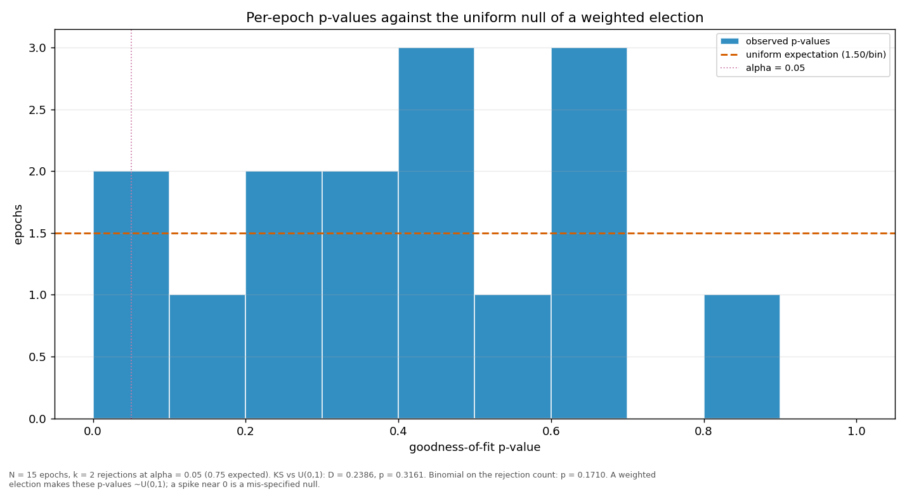

# Streaks and repeats

> Does a validator win more consecutive rounds, or repeat more often, than a weighted draw would produce? Both are compared against a Monte-Carlo reference built from the same weights the election used.

| epoch | L_max obs | L_max MC mean | p | repeat obs | repeat MC mean | p |
|---|---:|---:|---:|---:|---:|---:|
| 2 | 13 | 12.88 | 0.4541 | 0.5960 | 0.5858 | 0.4672 |
| 3 | 12 | 11.94 | 0.4662 | 0.5253 | 0.5639 | 0.7513 |
| 4 | 14 | 13.77 | 0.4429 | 0.6970 | 0.6102 | 0.0994 |
| 5 | 12 | 12.96 | 0.5765 | 0.5657 | 0.5909 | 0.6802 |
| 6 | 17 | 12.15 | 0.1215 | 0.5859 | 0.5725 | 0.4466 |
| 7 | 6 | 13.28 | 0.9994 | 0.4141 | 0.5981 | 0.9985 |
| 8 | 9 | 12.27 | 0.8607 | 0.5152 | 0.5736 | 0.8384 |
| 9 | 14 | 13.10 | 0.3816 | 0.6263 | 0.5928 | 0.3292 |
| 10 | 12 | 13.82 | 0.6620 | 0.5253 | 0.6120 | 0.9187 |
| 11 | 13 | 12.51 | 0.4175 | 0.5758 | 0.5775 | 0.5392 |
| 12 | 18 | 12.87 | 0.1192 | 0.6162 | 0.5891 | 0.3638 |
| 13 | 12 | 12.12 | 0.4870 | 0.6061 | 0.5675 | 0.3013 |
| 14 | 9 | 12.42 | 0.8707 | 0.6162 | 0.5744 | 0.2852 |
| 15 | 18 | 11.73 | 0.0743 | 0.6768 | 0.5554 | 0.0340 |
| 16 | 7 | 8.00 | 0.6244 | 0.6400 | 0.5756 | 0.3611 |
| all | 18 | 22.11 | 0.8735 | 0.5855 | 0.5832 | 0.4556 |

