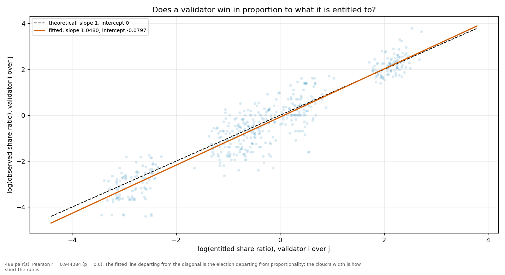
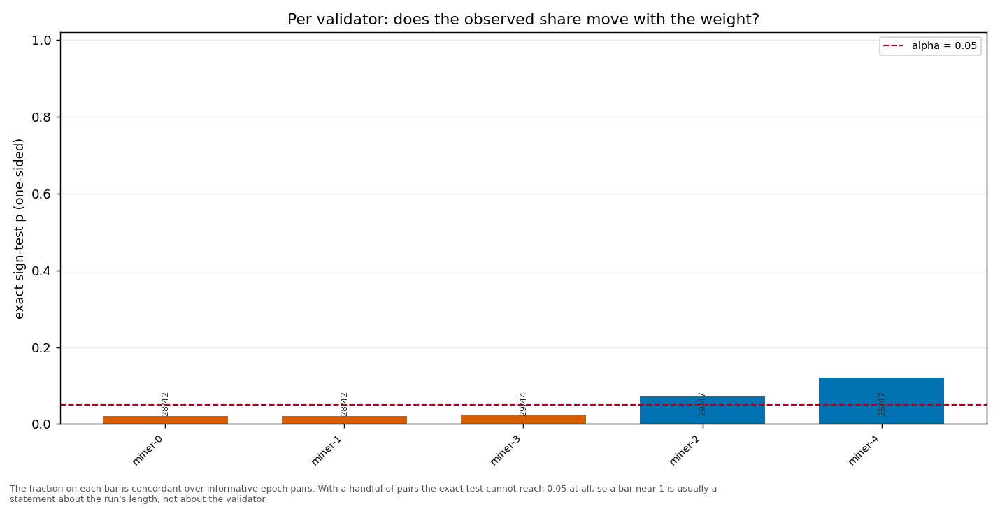

# Longitudinal behaviour

> Across epochs rather than within one: does a validator's share move with its weight, and does it move in proportion?

- **GLM logit on log(weight)**: beta1 = 1.5359 (95% CI [1.4996, 1.5722], n = 250, converged = True). H0 of weighted sortition is beta1 = 1 — NOT consistent.
- **Pairwise log-ratio regression**: slope = 1.0480, intercept = -0.0797, Pearson r = 0.9444 (p = 0.0000), n = 488 pairs. Proportional selection implies slope 1 and intercept 0.
- **Sign test (weight ↔ share monotonicity)**: 5 validator(s) tested; p-values 0.0244, 0.0218, 0.0719, 0.0218, 0.1215.

