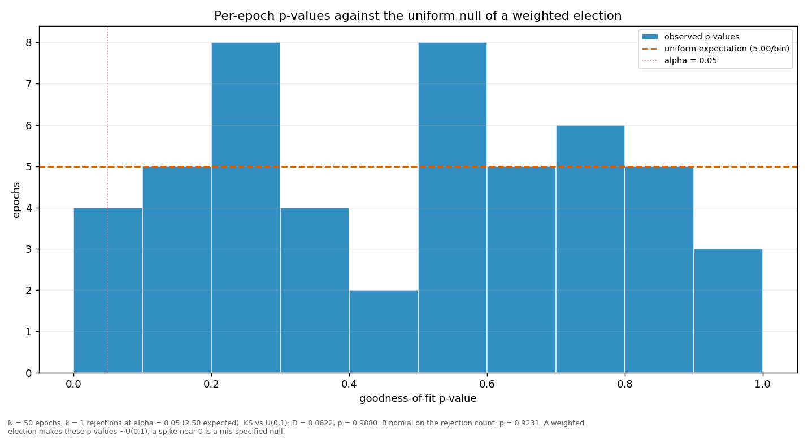

# Streaks and repeats

> Does a validator win more consecutive rounds, or repeat more often, than a weighted draw would produce? Both are compared against a Monte-Carlo reference built from the same weights the election used.

| epoch | L_max obs | L_max MC mean | p | repeat obs | repeat MC mean | p |
|---|---:|---:|---:|---:|---:|---:|
| 2 | 14 | 11.71 | 0.2540 | 0.6667 | 0.5479 | 0.0403 |
| 3 | 13 | 10.96 | 0.2625 | 0.5657 | 0.5278 | 0.3035 |
| 4 | 12 | 12.59 | 0.5440 | 0.5455 | 0.5755 | 0.6981 |
| 5 | 13 | 11.71 | 0.3403 | 0.5960 | 0.5512 | 0.2708 |
| 6 | 10 | 11.78 | 0.7091 | 0.6869 | 0.5551 | 0.0269 |
| 7 | 11 | 12.12 | 0.6181 | 0.6061 | 0.5631 | 0.2818 |
| 8 | 15 | 11.61 | 0.1786 | 0.4646 | 0.5478 | 0.9113 |
| 9 | 14 | 12.48 | 0.3244 | 0.6970 | 0.5721 | 0.0347 |
| 10 | 13 | 12.69 | 0.4401 | 0.5556 | 0.5800 | 0.6744 |
| 11 | 14 | 11.65 | 0.2484 | 0.6263 | 0.5493 | 0.1368 |
| 12 | 11 | 11.58 | 0.5578 | 0.4242 | 0.5467 | 0.9762 |
| 13 | 11 | 11.75 | 0.5771 | 0.5556 | 0.5512 | 0.5089 |
| 14 | 16 | 12.42 | 0.1810 | 0.5960 | 0.5710 | 0.3783 |
| 15 | 6 | 11.18 | 0.9933 | 0.4242 | 0.5348 | 0.9644 |
| 16 | 7 | 11.70 | 0.9742 | 0.4949 | 0.5500 | 0.8205 |
| 17 | 12 | 12.05 | 0.4913 | 0.5455 | 0.5604 | 0.6176 |
| 18 | 16 | 12.54 | 0.1909 | 0.5657 | 0.5766 | 0.5951 |
| 19 | 9 | 12.23 | 0.8580 | 0.5354 | 0.5678 | 0.7136 |
| 20 | 13 | 11.24 | 0.2909 | 0.6667 | 0.5365 | 0.0288 |
| 21 | 11 | 11.20 | 0.5108 | 0.4646 | 0.5353 | 0.8800 |
| 22 | 16 | 12.61 | 0.1950 | 0.6465 | 0.5786 | 0.1674 |
| 23 | 10 | 11.75 | 0.7076 | 0.5758 | 0.5545 | 0.4027 |
| 24 | 9 | 13.72 | 0.9318 | 0.5960 | 0.6070 | 0.5987 |
| 25 | 14 | 14.01 | 0.4644 | 0.7778 | 0.6153 | 0.0075 |
| 26 | 19 | 11.93 | 0.0578 | 0.6970 | 0.5609 | 0.0240 |
| 27 | 15 | 11.43 | 0.1661 | 0.5960 | 0.5420 | 0.2274 |
| 28 | 14 | 12.76 | 0.3500 | 0.5152 | 0.5825 | 0.8705 |
| 29 | 13 | 13.77 | 0.5474 | 0.6061 | 0.6081 | 0.5475 |
| 30 | 6 | 12.44 | 0.9981 | 0.5253 | 0.5747 | 0.7962 |
| 31 | 13 | 14.06 | 0.5748 | 0.6061 | 0.6168 | 0.5989 |
| 32 | 14 | 12.05 | 0.2851 | 0.6162 | 0.5619 | 0.2227 |
| 33 | 15 | 11.37 | 0.1608 | 0.4444 | 0.5400 | 0.9400 |
| 34 | 8 | 11.56 | 0.9106 | 0.5960 | 0.5468 | 0.2480 |
| 35 | 20 | 13.39 | 0.0861 | 0.6869 | 0.5968 | 0.0942 |
| 36 | 8 | 11.99 | 0.9335 | 0.5354 | 0.5590 | 0.6678 |
| 37 | 14 | 12.60 | 0.3355 | 0.6162 | 0.5762 | 0.2985 |
| 38 | 9 | 11.84 | 0.8297 | 0.6061 | 0.5554 | 0.2431 |
| 39 | 16 | 11.99 | 0.1558 | 0.5960 | 0.5592 | 0.3133 |
| 40 | 8 | 11.48 | 0.9096 | 0.5152 | 0.5426 | 0.6855 |
| 41 | 11 | 10.68 | 0.4488 | 0.4747 | 0.5184 | 0.7699 |
| 42 | 13 | 10.85 | 0.2527 | 0.5859 | 0.5221 | 0.1816 |
| 43 | 8 | 12.04 | 0.9329 | 0.5152 | 0.5600 | 0.7732 |
| 44 | 18 | 12.14 | 0.0920 | 0.5657 | 0.5640 | 0.5199 |
| 45 | 10 | 12.45 | 0.7688 | 0.5960 | 0.5716 | 0.3837 |
| 46 | 7 | 12.17 | 0.9816 | 0.5051 | 0.5660 | 0.8435 |
| 47 | 15 | 11.82 | 0.1943 | 0.6364 | 0.5561 | 0.1223 |
| 48 | 9 | 12.34 | 0.8663 | 0.6364 | 0.5704 | 0.1731 |
| 49 | 12 | 11.65 | 0.4437 | 0.5960 | 0.5515 | 0.2712 |
| 50 | 17 | 11.69 | 0.1030 | 0.6263 | 0.5526 | 0.1460 |
| 51 | 11 | 7.14 | 0.1270 | 0.6000 | 0.5605 | 0.4659 |
| all | 20 | 25.12 | 0.9497 | 0.5781 | 0.5607 | 0.0290 |

