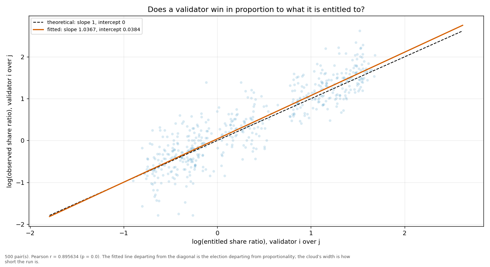
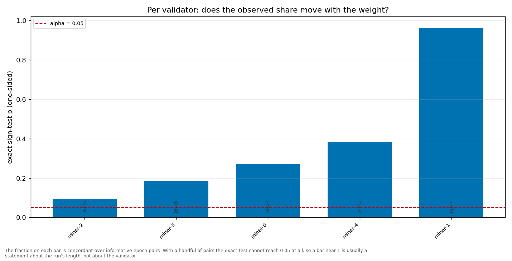

# Longitudinal behaviour

> Across epochs rather than within one: does a validator's share move with its weight, and does it move in proportion?

- **GLM logit on log(weight)**: beta1 = 1.4125 (95% CI [1.3561, 1.4688], n = 250, converged = True). H0 of weighted sortition is beta1 = 1 — NOT consistent.
- **Pairwise log-ratio regression**: slope = 1.0367, intercept = 0.0384, Pearson r = 0.8956 (p = 0.0000), n = 500 pairs. Proportional selection implies slope 1 and intercept 0.
- **Sign test (weight ↔ share monotonicity)**: 5 validator(s) tested; p-values 0.0920, 0.1856, 0.3830, 0.2712, 0.9605.

