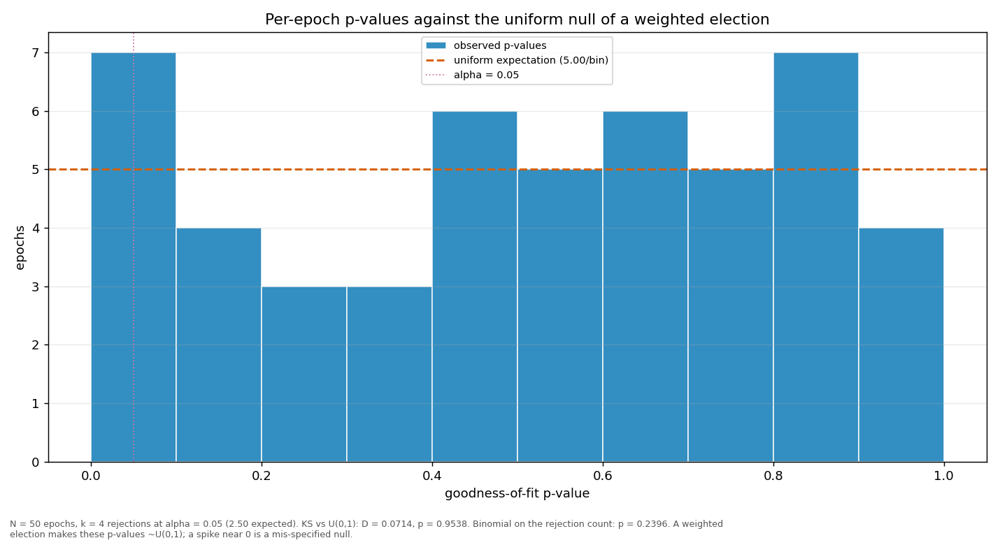

# Streaks and repeats

> Does a validator win more consecutive rounds, or repeat more often, than a weighted draw would produce? Both are compared against a Monte-Carlo reference built from the same weights the election used.

| epoch | L_max obs | L_max MC mean | p | repeat obs | repeat MC mean | p |
|---|---:|---:|---:|---:|---:|---:|
| 2 | 4 | 5.25 | 0.9245 | 0.2525 | 0.2814 | 0.7452 |
| 3 | 6 | 5.12 | 0.3265 | 0.3131 | 0.2761 | 0.2522 |
| 4 | 5 | 5.39 | 0.6796 | 0.2323 | 0.2877 | 0.8895 |
| 5 | 4 | 5.22 | 0.9219 | 0.1818 | 0.2793 | 0.9825 |
| 6 | 6 | 5.29 | 0.3704 | 0.3333 | 0.2860 | 0.1971 |
| 7 | 3 | 5.32 | 0.9995 | 0.1717 | 0.2842 | 0.9929 |
| 8 | 5 | 5.18 | 0.6274 | 0.3636 | 0.2793 | 0.0563 |
| 9 | 4 | 5.35 | 0.9340 | 0.2727 | 0.2841 | 0.6205 |
| 10 | 4 | 5.37 | 0.9359 | 0.2828 | 0.2858 | 0.5540 |
| 11 | 10 | 5.22 | 0.0142 | 0.2929 | 0.2788 | 0.4183 |
| 12 | 5 | 5.28 | 0.6482 | 0.4040 | 0.2826 | 0.0126 |
| 13 | 5 | 5.20 | 0.6298 | 0.2121 | 0.2789 | 0.9313 |
| 14 | 6 | 5.30 | 0.3731 | 0.2424 | 0.2832 | 0.8200 |
| 15 | 4 | 5.15 | 0.9130 | 0.2222 | 0.2766 | 0.8905 |
| 16 | 5 | 5.21 | 0.6334 | 0.3030 | 0.2804 | 0.3552 |
| 17 | 7 | 5.35 | 0.1936 | 0.2929 | 0.2845 | 0.4628 |
| 18 | 6 | 5.42 | 0.4037 | 0.2929 | 0.2905 | 0.5122 |
| 19 | 5 | 5.36 | 0.6701 | 0.3434 | 0.2869 | 0.1491 |
| 20 | 5 | 5.15 | 0.6167 | 0.2525 | 0.2768 | 0.7176 |
| 21 | 5 | 5.18 | 0.6264 | 0.3131 | 0.2793 | 0.2751 |
| 22 | 4 | 5.46 | 0.9448 | 0.3030 | 0.2925 | 0.4498 |
| 23 | 4 | 5.31 | 0.9308 | 0.2828 | 0.2850 | 0.5483 |
| 24 | 5 | 5.59 | 0.7284 | 0.2323 | 0.2980 | 0.9234 |
| 25 | 8 | 5.64 | 0.1268 | 0.2929 | 0.2981 | 0.5660 |
| 26 | 10 | 5.32 | 0.0167 | 0.3838 | 0.2859 | 0.0354 |
| 27 | 4 | 5.17 | 0.9160 | 0.3535 | 0.2782 | 0.0785 |
| 28 | 5 | 5.48 | 0.7015 | 0.2626 | 0.2944 | 0.7642 |
| 29 | 4 | 5.57 | 0.9517 | 0.3333 | 0.2948 | 0.2531 |
| 30 | 6 | 5.38 | 0.3941 | 0.3030 | 0.2877 | 0.4135 |
| 31 | 8 | 5.70 | 0.1329 | 0.2828 | 0.3033 | 0.6827 |
| 32 | 6 | 5.25 | 0.3601 | 0.3636 | 0.2803 | 0.0611 |
| 33 | 5 | 5.16 | 0.6177 | 0.2121 | 0.2761 | 0.9226 |
| 34 | 4 | 5.22 | 0.9224 | 0.2525 | 0.2816 | 0.7505 |
| 35 | 4 | 5.48 | 0.9464 | 0.2525 | 0.2906 | 0.8032 |
| 36 | 5 | 5.23 | 0.6373 | 0.2424 | 0.2779 | 0.7913 |
| 37 | 4 | 5.35 | 0.9340 | 0.2626 | 0.2845 | 0.6960 |
| 38 | 5 | 5.30 | 0.6537 | 0.2929 | 0.2825 | 0.4498 |
| 39 | 5 | 5.26 | 0.6450 | 0.2626 | 0.2818 | 0.6818 |
| 40 | 4 | 5.22 | 0.9210 | 0.2121 | 0.2781 | 0.9296 |
| 41 | 6 | 5.02 | 0.3019 | 0.3131 | 0.2718 | 0.2245 |
| 42 | 6 | 5.11 | 0.3248 | 0.2525 | 0.2754 | 0.7115 |
| 43 | 5 | 5.28 | 0.6503 | 0.3838 | 0.2838 | 0.0310 |
| 44 | 9 | 5.33 | 0.0416 | 0.3434 | 0.2851 | 0.1413 |
| 45 | 4 | 5.27 | 0.9271 | 0.2424 | 0.2806 | 0.8069 |
| 46 | 5 | 5.35 | 0.6668 | 0.2828 | 0.2862 | 0.5555 |
| 47 | 4 | 5.29 | 0.9304 | 0.2727 | 0.2845 | 0.6231 |
| 48 | 5 | 5.35 | 0.6676 | 0.2828 | 0.2865 | 0.5595 |
| 49 | 4 | 5.25 | 0.9261 | 0.2727 | 0.2838 | 0.6202 |
| 50 | 4 | 5.26 | 0.9275 | 0.2525 | 0.2843 | 0.7665 |
| 51 | 2 | 3.46 | 0.9971 | 0.2000 | 0.2818 | 0.8281 |
| all | 10 | 10.18 | 0.6148 | 0.2823 | 0.2840 | 0.5918 |

