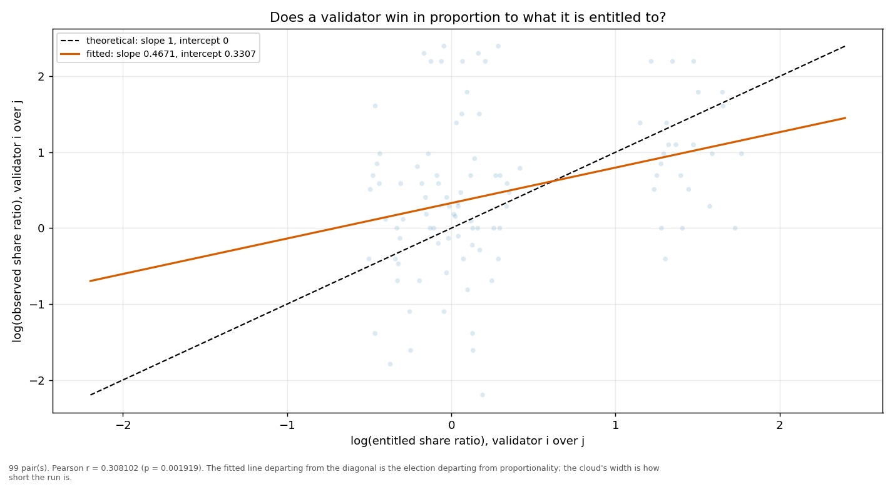
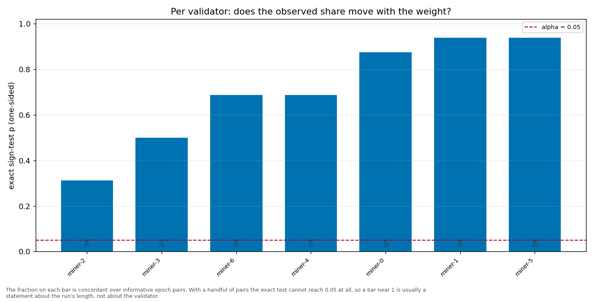

# Longitudinal behaviour

> Across epochs rather than within one: does a validator's share move with its weight, and does it move in proportion?

- **GLM logit on log(weight)**: beta1 = 0.8135 (95% CI [0.3995, 1.2276], n = 35, converged = True). H0 of weighted sortition is beta1 = 1 — consistent.
- **Pairwise log-ratio regression**: slope = 0.4671, intercept = 0.3307, Pearson r = 0.3081 (p = 0.0019), n = 99 pairs. Proportional selection implies slope 1 and intercept 0.
- **Sign test (weight ↔ share monotonicity)**: 7 validator(s) tested; p-values 0.5000, 0.9375, 0.6875, 0.9375, 0.8750, 0.3125.

