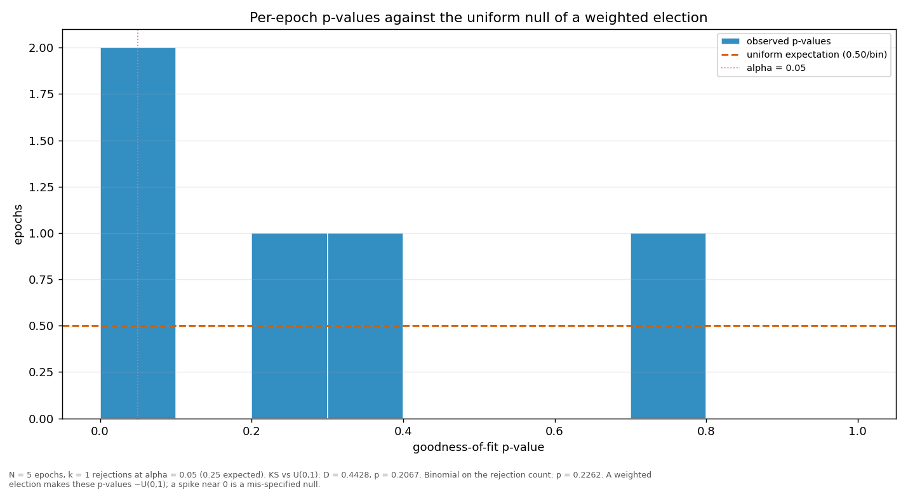

# Streaks and repeats

> Does a validator win more consecutive rounds, or repeat more often, than a weighted draw would produce? Both are compared against a Monte-Carlo reference built from the same weights the election used.

| epoch | L_max obs | L_max MC mean | p | repeat obs | repeat MC mean | p |
|---|---:|---:|---:|---:|---:|---:|
| 2 | 4 | 2.75 | 0.1284 | 0.3077 | 0.1586 | 0.0140 |
| 3 | 4 | 2.78 | 0.1436 | 0.2564 | 0.1624 | 0.0906 |
| 4 | 3 | 2.75 | 0.5897 | 0.2051 | 0.1596 | 0.2735 |
| 5 | 3 | 2.76 | 0.5981 | 0.2821 | 0.1603 | 0.0402 |
| 6 | 3 | 2.40 | 0.3615 | 0.2500 | 0.1590 | 0.2046 |
| all | 4 | 3.54 | 0.4397 | 0.2517 | 0.1606 | 0.0040 |

