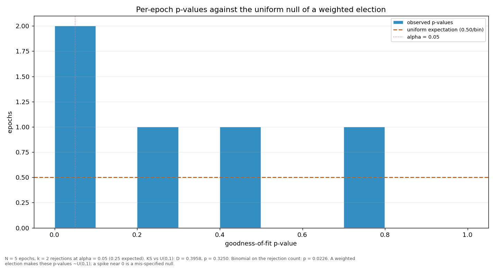

# Streaks and repeats

> Does a validator win more consecutive rounds, or repeat more often, than a weighted draw would produce? Both are compared against a Monte-Carlo reference built from the same weights the election used.

| epoch | L_max obs | L_max MC mean | p | repeat obs | repeat MC mean | p |
|---|---:|---:|---:|---:|---:|---:|
| 2 | 7 | 2.75 | 0.0008 | 0.5385 | 0.1591 | 0.0001 |
| 3 | 3 | 2.80 | 0.6176 | 0.2564 | 0.1626 | 0.0912 |
| 4 | 5 | 2.76 | 0.0230 | 0.3077 | 0.1603 | 0.0152 |
| 5 | 5 | 2.78 | 0.0280 | 0.3077 | 0.1617 | 0.0159 |
| 6 | 3 | 2.41 | 0.3668 | 0.3000 | 0.1595 | 0.0896 |
| all | 5 | 3.52 | 0.0975 | 0.2789 | 0.1602 | 0.0004 |

