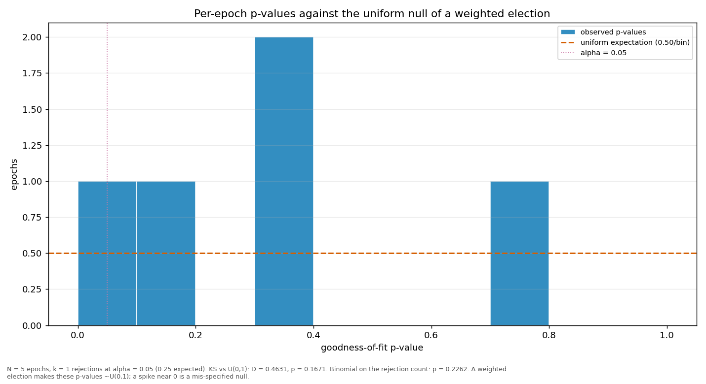

# Streaks and repeats

> Does a validator win more consecutive rounds, or repeat more often, than a weighted draw would produce? Both are compared against a Monte-Carlo reference built from the same weights the election used.

| epoch | L_max obs | L_max MC mean | p | repeat obs | repeat MC mean | p |
|---|---:|---:|---:|---:|---:|---:|
| 2 | 5 | 2.75 | 0.0232 | 0.4615 | 0.1596 | 0.0002 |
| 3 | 4 | 2.80 | 0.1442 | 0.3590 | 0.1631 | 0.0026 |
| 4 | 4 | 2.75 | 0.1284 | 0.3333 | 0.1592 | 0.0056 |
| 5 | 3 | 2.77 | 0.6040 | 0.3077 | 0.1615 | 0.0167 |
| 6 | 3 | 2.40 | 0.3579 | 0.2500 | 0.1588 | 0.2022 |
| all | 4 | 3.53 | 0.4383 | 0.2993 | 0.1604 | 0.0001 |

