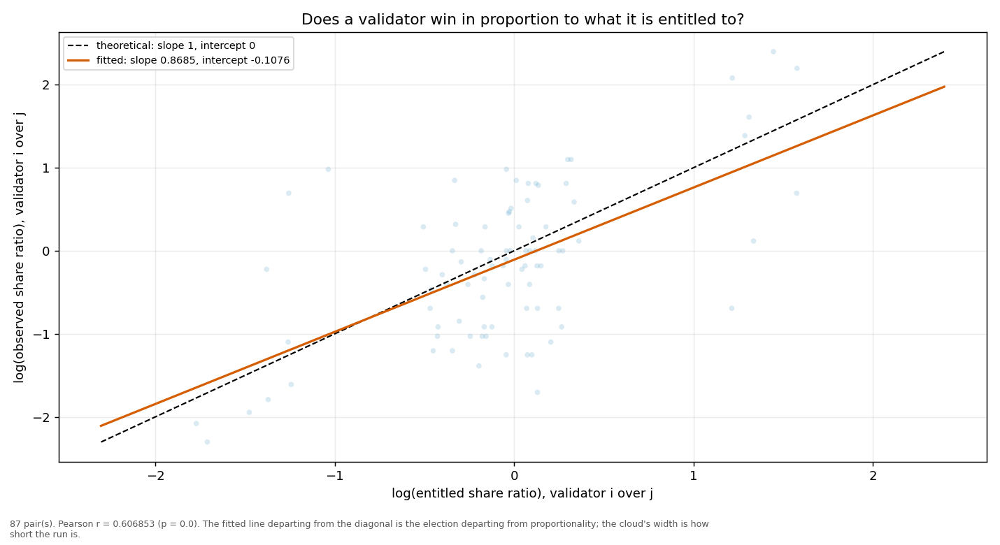
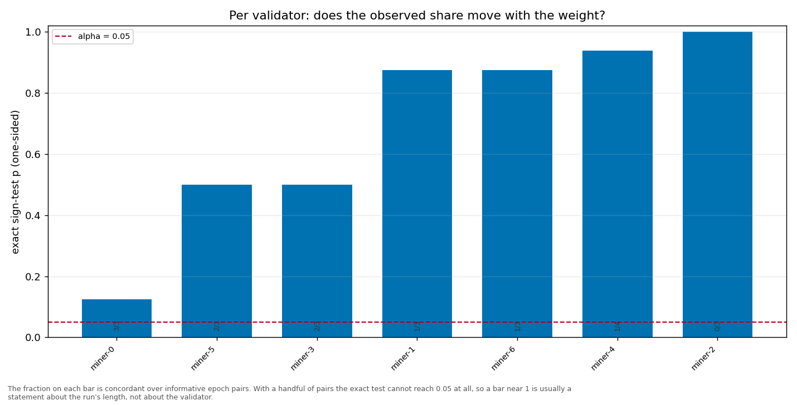

# Longitudinal behaviour

> Across epochs rather than within one: does a validator's share move with its weight, and does it move in proportion?

- **GLM logit on log(weight)**: beta1 = 0.9664 (95% CI [0.5250, 1.4078], n = 35, converged = True). H0 of weighted sortition is beta1 = 1 — consistent.
- **Pairwise log-ratio regression**: slope = 0.8685, intercept = -0.1076, Pearson r = 0.6069 (p = 0.0000), n = 87 pairs. Proportional selection implies slope 1 and intercept 0.
- **Sign test (weight ↔ share monotonicity)**: 7 validator(s) tested; p-values 0.8750, 0.8750, 0.1250, 0.9375, 0.5000, 0.5000.

