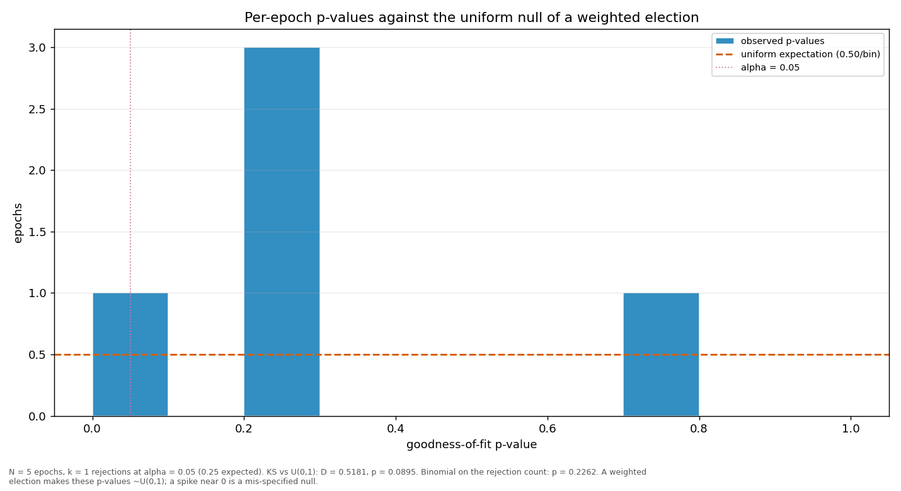

# Streaks and repeats

> Does a validator win more consecutive rounds, or repeat more often, than a weighted draw would produce? Both are compared against a Monte-Carlo reference built from the same weights the election used.

| epoch | L_max obs | L_max MC mean | p | repeat obs | repeat MC mean | p |
|---|---:|---:|---:|---:|---:|---:|
| 2 | 4 | 2.75 | 0.1341 | 0.1795 | 0.1592 | 0.4315 |
| 3 | 2 | 2.80 | 0.9989 | 0.1795 | 0.1630 | 0.4539 |
| 4 | 4 | 2.76 | 0.1357 | 0.2564 | 0.1601 | 0.0840 |
| 5 | 6 | 2.78 | 0.0054 | 0.2051 | 0.1613 | 0.2924 |
| 6 | 2 | 2.41 | 0.9670 | 0.2000 | 0.1597 | 0.3960 |
| all | 6 | 3.54 | 0.0205 | 0.2041 | 0.1604 | 0.0965 |

