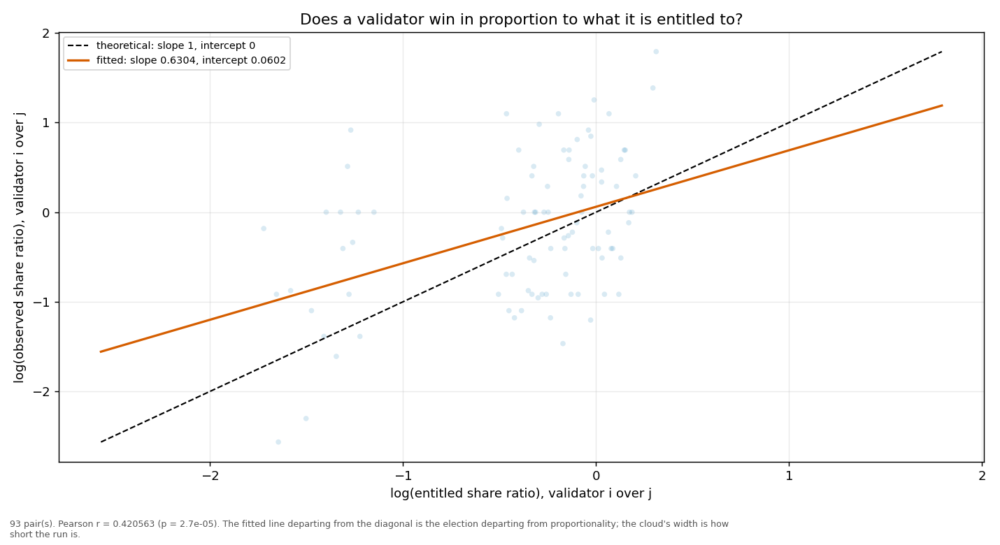
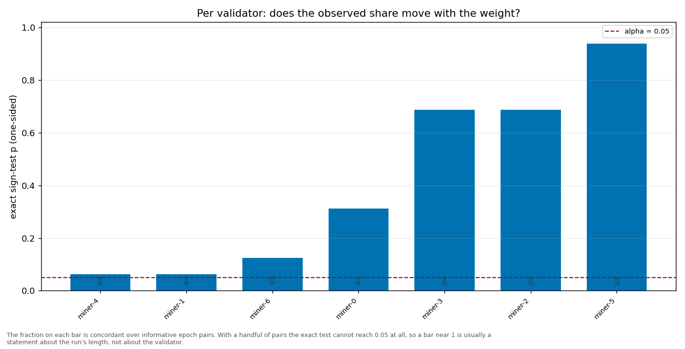

# Longitudinal behaviour

> Across epochs rather than within one: does a validator's share move with its weight, and does it move in proportion?

- **GLM logit on log(weight)**: beta1 = 1.0415 (95% CI [0.5767, 1.5062], n = 35, converged = True). H0 of weighted sortition is beta1 = 1 — consistent.
- **Pairwise log-ratio regression**: slope = 0.6304, intercept = 0.0602, Pearson r = 0.4206 (p = 0.0000), n = 93 pairs. Proportional selection implies slope 1 and intercept 0.
- **Sign test (weight ↔ share monotonicity)**: 7 validator(s) tested; p-values 0.0625, 0.9375, 0.3125, 0.0625, 0.6875, 0.1250.

