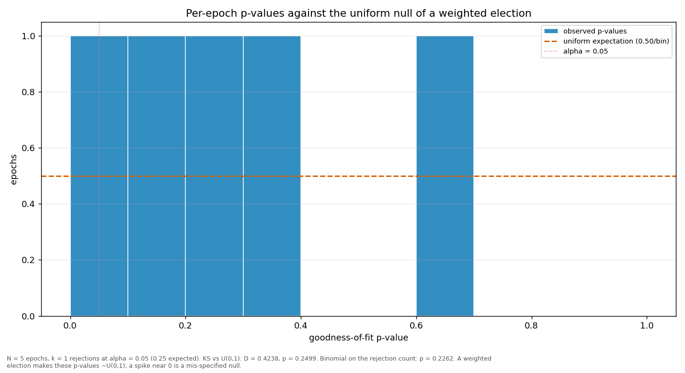

# Streaks and repeats

> Does a validator win more consecutive rounds, or repeat more often, than a weighted draw would produce? Both are compared against a Monte-Carlo reference built from the same weights the election used.

| epoch | L_max obs | L_max MC mean | p | repeat obs | repeat MC mean | p |
|---|---:|---:|---:|---:|---:|---:|
| 2 | 4 | 2.76 | 0.1356 | 0.3590 | 0.1590 | 0.0020 |
| 3 | 5 | 2.79 | 0.0293 | 0.2821 | 0.1629 | 0.0445 |
| 4 | 4 | 2.76 | 0.1374 | 0.3333 | 0.1596 | 0.0055 |
| 5 | 4 | 2.78 | 0.1410 | 0.2821 | 0.1613 | 0.0400 |
| 6 | 2 | 2.42 | 0.9686 | 0.1500 | 0.1595 | 0.6412 |
| all | 5 | 3.54 | 0.0964 | 0.2721 | 0.1606 | 0.0009 |

