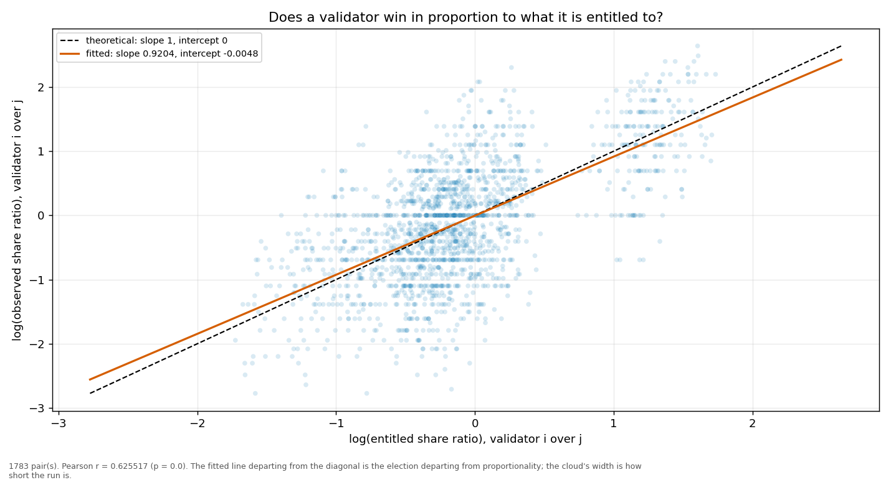
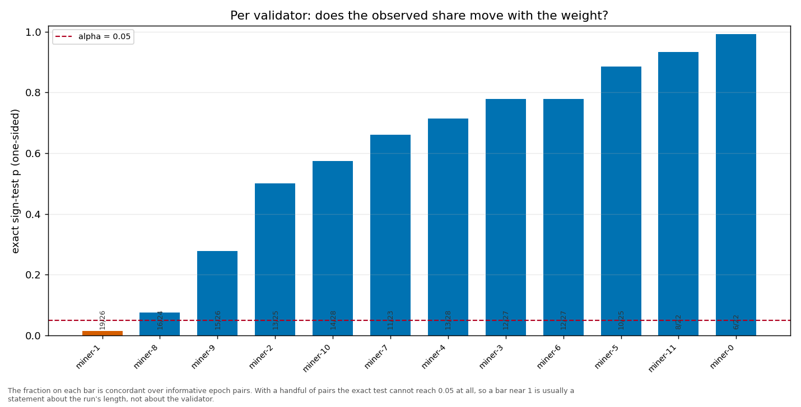

# Longitudinal behaviour

> Across epochs rather than within one: does a validator's share move with its weight, and does it move in proportion?

- **GLM logit on log(weight)**: beta1 = 1.1150 (95% CI [0.9737, 1.2564], n = 360, converged = True). H0 of weighted sortition is beta1 = 1 — consistent.
- **Pairwise log-ratio regression**: slope = 0.9204, intercept = -0.0048, Pearson r = 0.6255 (p = 0.0000), n = 1783 pairs. Proportional selection implies slope 1 and intercept 0.
- **Sign test (weight ↔ share monotonicity)**: 12 validator(s) tested; p-values 0.9915, 0.0145, 0.7790, 0.5747, 0.6612, 0.8852.

