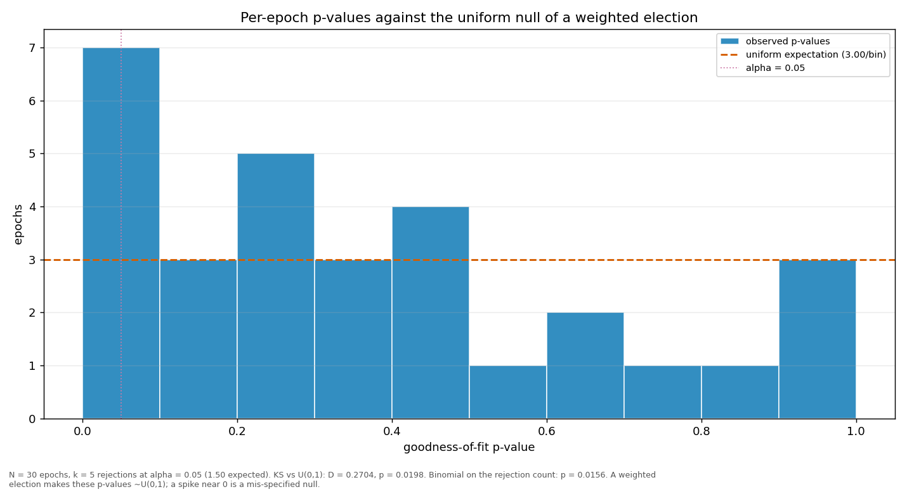

# Streaks and repeats

> Does a validator win more consecutive rounds, or repeat more often, than a weighted draw would produce? Both are compared against a Monte-Carlo reference built from the same weights the election used.

| epoch | L_max obs | L_max MC mean | p | repeat obs | repeat MC mean | p |
|---|---:|---:|---:|---:|---:|---:|
| 2 | 3 | 2.43 | 0.3825 | 0.2931 | 0.0921 | 0.0001 |
| 3 | 3 | 2.46 | 0.4085 | 0.2542 | 0.0949 | 0.0004 |
| 4 | 3 | 2.48 | 0.4182 | 0.1695 | 0.0962 | 0.0577 |
| 5 | 4 | 2.46 | 0.0509 | 0.2373 | 0.0953 | 0.0011 |
| 6 | 6 | 2.46 | 0.0008 | 0.2712 | 0.0943 | 0.0003 |
| 7 | 2 | 2.45 | 0.9971 | 0.1695 | 0.0944 | 0.0478 |
| 8 | 3 | 2.46 | 0.4067 | 0.1864 | 0.0949 | 0.0213 |
| 9 | 2 | 2.45 | 0.9970 | 0.0678 | 0.0946 | 0.8159 |
| 10 | 4 | 2.44 | 0.0445 | 0.2203 | 0.0933 | 0.0024 |
| 11 | 3 | 2.44 | 0.3953 | 0.1864 | 0.0932 | 0.0186 |
| 12 | 2 | 2.47 | 0.9977 | 0.2034 | 0.0961 | 0.0086 |
| 13 | 4 | 2.47 | 0.0527 | 0.1864 | 0.0960 | 0.0253 |
| 14 | 4 | 2.44 | 0.0455 | 0.2203 | 0.0935 | 0.0025 |
| 15 | 3 | 2.46 | 0.4054 | 0.1864 | 0.0947 | 0.0219 |
| 16 | 3 | 2.45 | 0.3978 | 0.1186 | 0.0946 | 0.3253 |
| 17 | 3 | 2.45 | 0.3980 | 0.1864 | 0.0943 | 0.0206 |
| 18 | 4 | 2.46 | 0.0483 | 0.2373 | 0.0951 | 0.0008 |
| 19 | 3 | 2.45 | 0.4017 | 0.1525 | 0.0948 | 0.1062 |
| 20 | 3 | 2.48 | 0.4240 | 0.1864 | 0.0970 | 0.0266 |
| 21 | 3 | 2.47 | 0.4133 | 0.1695 | 0.0961 | 0.0542 |
| 22 | 4 | 2.46 | 0.0498 | 0.1356 | 0.0953 | 0.2021 |
| 23 | 4 | 2.45 | 0.0484 | 0.3051 | 0.0943 | 0.0001 |
| 24 | 3 | 2.43 | 0.3874 | 0.2034 | 0.0927 | 0.0067 |
| 25 | 2 | 2.47 | 0.9974 | 0.1356 | 0.0957 | 0.2040 |
| 26 | 2 | 2.47 | 0.9966 | 0.1695 | 0.0965 | 0.0583 |
| 27 | 3 | 2.46 | 0.4102 | 0.2034 | 0.0957 | 0.0103 |
| 28 | 4 | 2.46 | 0.0510 | 0.2034 | 0.0956 | 0.0091 |
| 29 | 3 | 2.47 | 0.4115 | 0.1695 | 0.0958 | 0.0559 |
| 30 | 4 | 2.46 | 0.0495 | 0.2373 | 0.0953 | 0.0010 |
| 31 | 4 | 2.03 | 0.0137 | 0.3000 | 0.0943 | 0.0096 |
| all | 6 | 3.96 | 0.0175 | 0.1917 | 0.0945 | 0.0001 |

