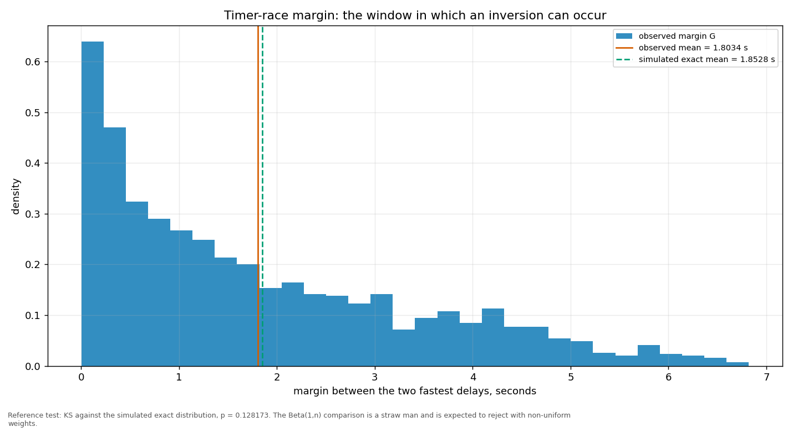
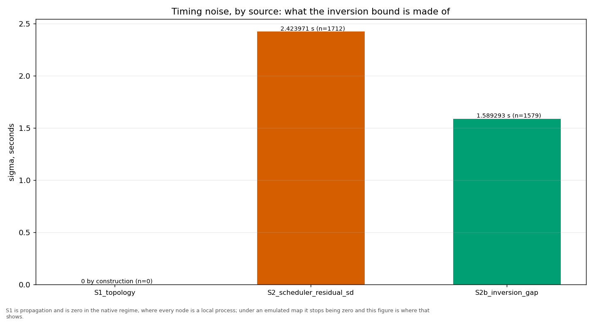
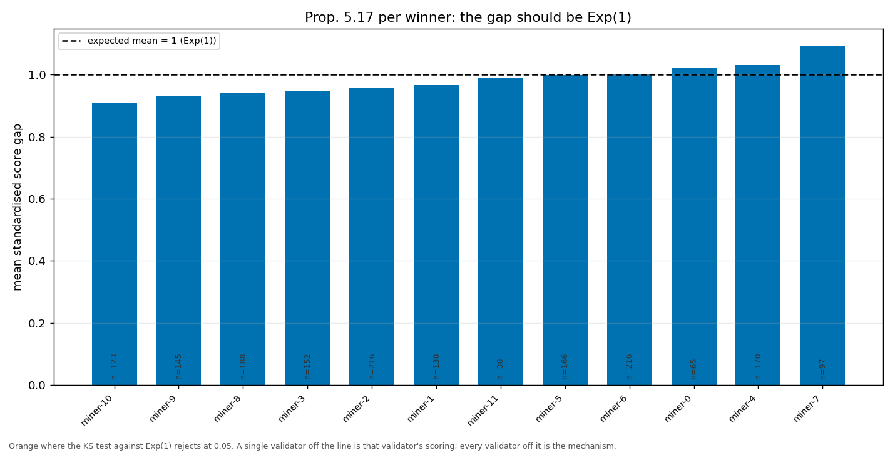
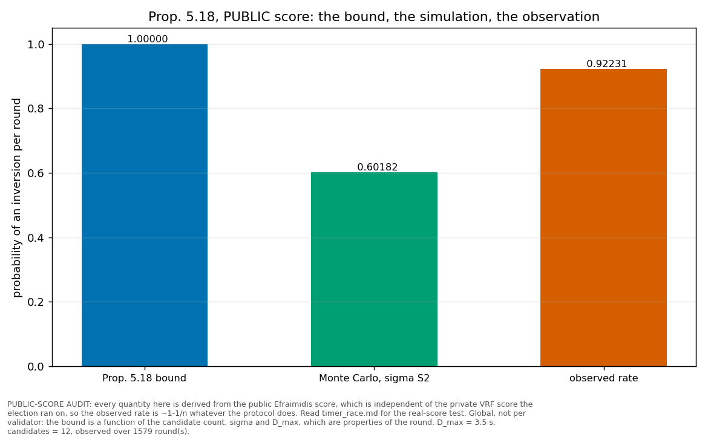

# The timer race

> The margin between the two fastest delays is the window in which an inversion can occur. This report carries the margin itself, what the timing noise is made of, and the two propositions that bound it.

## The winner's real score

Every `_public` quantity in the next section is derived from the PUBLIC Efraimidis score, `HMAC-SHA256(seed, address)` — the only form computable for a validator whose secret key this node does not hold. Under private sortition the election draws from a VRF under each proposer's own key, so the public score is **statistically independent** of the one the timers were set from: `inversion_rate_public` has expectation `1 - 1/n` whatever the protocol does, and `corr(dt_prev, delay_public)` has expectation 0. Those columns cannot show the mechanism working **or** broken.

This section uses the winner's REAL score instead, recomputed from the VRF reveal its own block carries — the same recomputation the validator performs to enforce the time bar.

| quantity | value | works | decoupled |
|---|---:|---:|---:|
| rounds with a real score | 1712 |  |  |
| corr(dt_prev, delay_true) — Q1 | 0.94826 | ~1 | ~0 |
| residual mean (s) | 1.32572 | ~0 | < 0 |
| residual sd (s) | 0.67099 | ~sigma S1 | ~sd(band) |
| mean score_norm of winner — Q2 | 0.50546 | 0.5 | ~1 |
| KS vs U(0,1), p — Q2 | 0.00011 | not rej. | ~0 |
| winner is the argmin (KS not rejected) | no | true | false |

Q2 needs only the winner because the minimum of the field is `Exp(W)`, so `1 - exp(-W*min)` is exactly `U(0,1)` (Prop. 5.10); a winner drawn without regard to score carries its own score instead, whose normalised value piles up against 1.

**Read the pooled KS line with the split below, not on its own.** A round won *at the top of the delay band* — the winner's timer ran all the way out to `T(1+delta) + lambda*Phi` — is a round in which the lower-score validators did not propose at all. Its winner scores against its own draw rather than the minimum of the field, so its `score_norm` sits against 1 by construction. That is a liveness question, not an ordering one, and pooling it with the racing rounds makes a KS test reject a mechanism that the racing rounds show working.

| quantity | racing rounds | won at the band top |
|---|---:|---:|
| rounds | 1610 | 102 |
| share of measured rounds | | 0.05954 |
| corr(dt_prev, delay_true) | 0.94152 | — |
| residual sd (s) | 0.67330 | — |
| mean score_norm of winner | 0.47417 | — |
| KS vs U(0,1), p | 0.00053 | — |

Weights are read as of the sampling tip, so a round sampled after its own epoch closed may be scored on the next epoch's weights. Those rows are flagged and the same two tests are repeated without them — if the verdict is unchanged, the staleness does not matter here.

| quantity | all rounds | fresh weights only |
|---|---:|---:|
| rounds | 1712 | 1712 |
| corr(dt_prev, delay_true) | 0.94826 | 0.94826 |
| mean score_norm of winner | 0.50546 | 0.50546 |
| KS vs U(0,1), p | 0.00011 | 0.00011 |
| rounds excluded as stale | 0 | — |

## The public-score model audit

Kept, and suffixed `_public`, because these numbers have been published. Read them as an audit of the model and its inputs, never as a statement about who actually won.

| quantity | value |
|---|---|
| rounds measured | 1713 |
| margins observed | 1713 |
| mean margin G (s) | 1.80337 |
| KS vs Beta(1,n) — straw man, p | 0.00000 |
| KS vs simulated exact — reference, p | 0.12817 |
| sigma S1 (topology) | 0.000000 |
| sigma S2 (scheduler residual, public) | 2.423971 |
| inversion bound (Prop. 5.18, public) | 1.00000 |
| inversion probability, MC with sigma_S2 (public) | 0.60182 |
| inversions observed (public) | 1579 |
| inversion rate observed (public) | 0.92231 |

The Beta(1,n) test is a **straw man**: it assumes uniform weights and is expected to reject whenever they are not uniform. The reference test is the KS against the simulated exact distribution of the implemented sortition.

S1 is the propagation term: the spread of the end-to-end one-way delay between validator pairs, over the shortest paths of the map this run used. Under an emulated map it is a measurement; in the native regime every node is a local process, so there is no map and S1 is reported as 0 because it is absent, not because it came out small. Either way the bound below rests on S2 alone -- whether the two sources should be combined is a modelling decision that has not been taken here, so S1 is reported beside the bound and not inside it.

