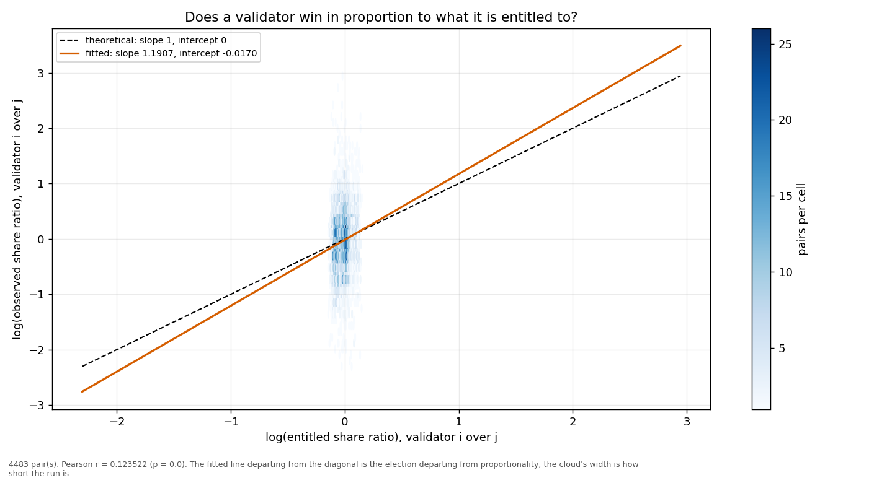
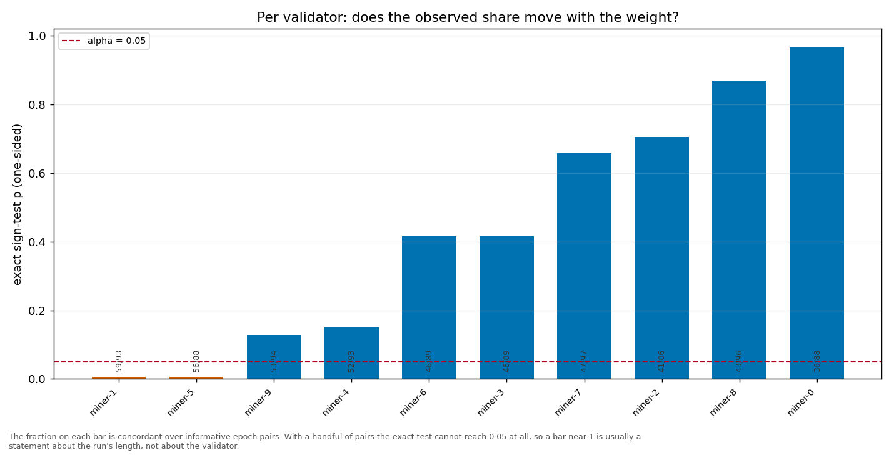

# Longitudinal behaviour

> Across epochs rather than within one: does a validator's share move with its weight, and does it move in proportion?

- **GLM logit on log(weight)**: beta1 = 1.3661 (95% CI [0.8674, 1.8649], n = 1000, converged = True). H0 of weighted sortition is beta1 = 1 — consistent.
- **Pairwise log-ratio regression**: slope = 1.1907, intercept = -0.0170, Pearson r = 0.1235 (p = 0.0000), n = 4483 pairs. Proportional selection implies slope 1 and intercept 0.
- **Sign test (weight ↔ share monotonicity)**: 10 validator(s) tested; p-values 0.9653, 0.4161, 0.8693, 0.6576, 0.1499, 0.1282.

