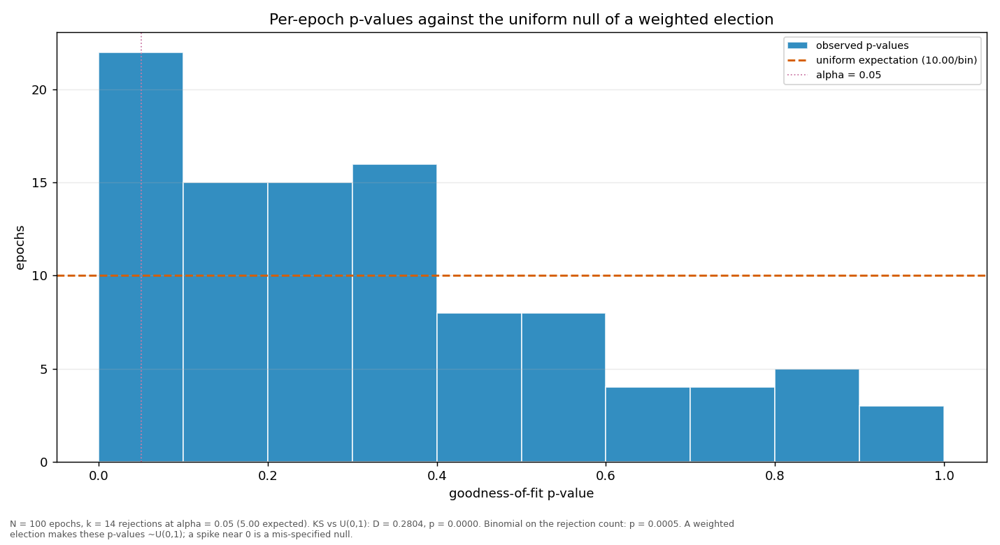

# Streaks and repeats

> Does a validator win more consecutive rounds, or repeat more often, than a weighted draw would produce? Both are compared against a Monte-Carlo reference built from the same weights the election used.

| epoch | L_max obs | L_max MC mean | p | repeat obs | repeat MC mean | p |
|---|---:|---:|---:|---:|---:|---:|
| 2 | 3 | 2.69 | 0.5973 | 0.2121 | 0.1009 | 0.0010 |
| 3 | 3 | 2.70 | 0.5984 | 0.2222 | 0.1009 | 0.0005 |
| 4 | 4 | 2.70 | 0.0869 | 0.2626 | 0.1009 | 0.0001 |
| 5 | 5 | 2.70 | 0.0086 | 0.2323 | 0.1009 | 0.0003 |
| 6 | 3 | 2.70 | 0.6016 | 0.1818 | 0.1009 | 0.0109 |
| 7 | 3 | 2.70 | 0.6008 | 0.1212 | 0.1009 | 0.2935 |
| 8 | 4 | 2.70 | 0.0878 | 0.3030 | 0.1008 | 0.0001 |
| 9 | 3 | 2.70 | 0.6010 | 0.1717 | 0.1009 | 0.0207 |
| 10 | 4 | 2.70 | 0.0872 | 0.2020 | 0.1009 | 0.0023 |
| 11 | 3 | 2.70 | 0.6016 | 0.1818 | 0.1009 | 0.0115 |
| 12 | 4 | 2.70 | 0.0865 | 0.2121 | 0.1009 | 0.0011 |
| 13 | 3 | 2.69 | 0.5992 | 0.1818 | 0.1009 | 0.0113 |
| 14 | 3 | 2.69 | 0.5968 | 0.1212 | 0.1008 | 0.2895 |
| 15 | 4 | 2.70 | 0.0866 | 0.2525 | 0.1008 | 0.0001 |
| 16 | 4 | 2.70 | 0.0874 | 0.2222 | 0.1009 | 0.0005 |
| 17 | 4 | 2.70 | 0.0863 | 0.1919 | 0.1009 | 0.0048 |
| 18 | 3 | 2.70 | 0.6000 | 0.1717 | 0.1010 | 0.0212 |
| 19 | 3 | 2.70 | 0.6006 | 0.1515 | 0.1008 | 0.0703 |
| 20 | 4 | 2.70 | 0.0864 | 0.1515 | 0.1009 | 0.0694 |
| 21 | 4 | 2.69 | 0.0859 | 0.2424 | 0.1009 | 0.0002 |
| 22 | 5 | 2.69 | 0.0083 | 0.1919 | 0.1009 | 0.0051 |
| 23 | 4 | 2.70 | 0.0869 | 0.2121 | 0.1009 | 0.0006 |
| 24 | 4 | 2.70 | 0.0871 | 0.2323 | 0.1010 | 0.0002 |
| 25 | 3 | 2.70 | 0.6002 | 0.1515 | 0.1010 | 0.0718 |
| 26 | 3 | 2.70 | 0.6027 | 0.2121 | 0.1010 | 0.0012 |
| 27 | 3 | 2.70 | 0.6005 | 0.1414 | 0.1009 | 0.1190 |
| 28 | 5 | 2.70 | 0.0086 | 0.1515 | 0.1010 | 0.0716 |
| 29 | 5 | 2.70 | 0.0081 | 0.2020 | 0.1008 | 0.0023 |
| 30 | 3 | 2.70 | 0.5992 | 0.1818 | 0.1009 | 0.0110 |
| 31 | 3 | 2.70 | 0.5997 | 0.1616 | 0.1009 | 0.0384 |
| 32 | 3 | 2.69 | 0.5976 | 0.1919 | 0.1008 | 0.0057 |
| 33 | 3 | 2.69 | 0.5980 | 0.1919 | 0.1009 | 0.0064 |
| 34 | 3 | 2.70 | 0.6029 | 0.1616 | 0.1010 | 0.0390 |
| 35 | 4 | 2.70 | 0.0873 | 0.2424 | 0.1008 | 0.0002 |
| 36 | 3 | 2.70 | 0.6016 | 0.1919 | 0.1008 | 0.0047 |
| 37 | 4 | 2.69 | 0.0869 | 0.1818 | 0.1009 | 0.0103 |
| 38 | 3 | 2.70 | 0.5991 | 0.1717 | 0.1009 | 0.0216 |
| 39 | 2 | 2.70 | 1.0000 | 0.1515 | 0.1008 | 0.0705 |
| 40 | 3 | 2.70 | 0.6022 | 0.1818 | 0.1010 | 0.0116 |
| 41 | 4 | 2.69 | 0.0857 | 0.2222 | 0.1009 | 0.0006 |
| 42 | 4 | 2.70 | 0.0869 | 0.1616 | 0.1010 | 0.0394 |
| 43 | 4 | 2.70 | 0.0879 | 0.2020 | 0.1010 | 0.0021 |
| 44 | 4 | 2.70 | 0.0878 | 0.2020 | 0.1010 | 0.0023 |
| 45 | 3 | 2.69 | 0.5998 | 0.2121 | 0.1009 | 0.0008 |
| 46 | 3 | 2.70 | 0.6005 | 0.2121 | 0.1009 | 0.0010 |
| 47 | 3 | 2.70 | 0.5999 | 0.1919 | 0.1009 | 0.0050 |
| 48 | 4 | 2.69 | 0.0863 | 0.1818 | 0.1009 | 0.0115 |
| 49 | 4 | 2.70 | 0.0864 | 0.1919 | 0.1009 | 0.0052 |
| 50 | 4 | 2.70 | 0.0885 | 0.1313 | 0.1009 | 0.1927 |
| 51 | 4 | 2.70 | 0.0864 | 0.1616 | 0.1010 | 0.0384 |
| 52 | 3 | 2.70 | 0.5991 | 0.2121 | 0.1009 | 0.0010 |
| 53 | 3 | 2.70 | 0.6011 | 0.2828 | 0.1010 | 0.0001 |
| 54 | 4 | 2.70 | 0.0874 | 0.1717 | 0.1010 | 0.0212 |
| 55 | 3 | 2.70 | 0.6019 | 0.1717 | 0.1009 | 0.0207 |
| 56 | 3 | 2.70 | 0.6009 | 0.2020 | 0.1009 | 0.0022 |
| 57 | 3 | 2.70 | 0.6012 | 0.1818 | 0.1009 | 0.0111 |
| 58 | 4 | 2.70 | 0.0873 | 0.2121 | 0.1009 | 0.0010 |
| 59 | 4 | 2.70 | 0.0886 | 0.1818 | 0.1010 | 0.0106 |
| 60 | 3 | 2.69 | 0.5986 | 0.1717 | 0.1009 | 0.0213 |
| 61 | 5 | 2.70 | 0.0084 | 0.2929 | 0.1009 | 0.0001 |
| 62 | 4 | 2.70 | 0.0862 | 0.1919 | 0.1009 | 0.0059 |
| 63 | 4 | 2.70 | 0.0871 | 0.2525 | 0.1009 | 0.0001 |
| 64 | 4 | 2.69 | 0.0868 | 0.2222 | 0.1009 | 0.0004 |
| 65 | 3 | 2.70 | 0.6032 | 0.1313 | 0.1009 | 0.1964 |
| 66 | 5 | 2.69 | 0.0085 | 0.2727 | 0.1009 | 0.0001 |
| 67 | 6 | 2.70 | 0.0013 | 0.2525 | 0.1009 | 0.0001 |
| 68 | 4 | 2.70 | 0.0870 | 0.2323 | 0.1010 | 0.0002 |
| 69 | 3 | 2.70 | 0.6010 | 0.1818 | 0.1010 | 0.0109 |
| 70 | 4 | 2.70 | 0.0864 | 0.2525 | 0.1010 | 0.0001 |
| 71 | 3 | 2.69 | 0.5988 | 0.2020 | 0.1010 | 0.0019 |
| 72 | 4 | 2.70 | 0.0876 | 0.2323 | 0.1009 | 0.0003 |
| 73 | 5 | 2.70 | 0.0090 | 0.2525 | 0.1010 | 0.0001 |
| 74 | 3 | 2.70 | 0.6001 | 0.2551 | 0.1010 | 0.0001 |
| 75 | 3 | 2.70 | 0.6008 | 0.2121 | 0.1008 | 0.0012 |
| 76 | 5 | 2.70 | 0.0081 | 0.2929 | 0.1010 | 0.0001 |
| 77 | 4 | 2.69 | 0.0861 | 0.2347 | 0.1008 | 0.0003 |
| 78 | 4 | 2.69 | 0.0863 | 0.2525 | 0.1007 | 0.0001 |
| 79 | 5 | 2.70 | 0.0088 | 0.2424 | 0.1009 | 0.0002 |
| 80 | 4 | 2.69 | 0.0855 | 0.2323 | 0.1008 | 0.0002 |
| 81 | 6 | 2.70 | 0.0013 | 0.2857 | 0.1010 | 0.0001 |
| 82 | 4 | 2.70 | 0.0869 | 0.2626 | 0.1009 | 0.0001 |
| 83 | 4 | 2.70 | 0.0870 | 0.2323 | 0.1009 | 0.0002 |
| 84 | 2 | 2.69 | 1.0000 | 0.1414 | 0.1007 | 0.1176 |
| 85 | 4 | 2.70 | 0.0881 | 0.2121 | 0.1008 | 0.0010 |
| 86 | 4 | 2.69 | 0.0865 | 0.2828 | 0.1009 | 0.0001 |
| 87 | 3 | 2.69 | 0.5969 | 0.2245 | 0.1009 | 0.0009 |
| 88 | 4 | 2.69 | 0.0869 | 0.2347 | 0.1009 | 0.0005 |
| 89 | 4 | 2.70 | 0.0883 | 0.3030 | 0.1010 | 0.0001 |
| 90 | 3 | 2.70 | 0.5992 | 0.2828 | 0.1010 | 0.0001 |
| 91 | 6 | 2.69 | 0.0013 | 0.2727 | 0.1008 | 0.0001 |
| 92 | 4 | 2.70 | 0.0862 | 0.2626 | 0.1009 | 0.0001 |
| 93 | 5 | 2.70 | 0.0085 | 0.2857 | 0.1010 | 0.0001 |
| 94 | 3 | 2.70 | 0.5977 | 0.2857 | 0.1010 | 0.0001 |
| 95 | 5 | 2.69 | 0.0078 | 0.2929 | 0.1010 | 0.0001 |
| 96 | 4 | 2.70 | 0.0874 | 0.2323 | 0.1009 | 0.0003 |
| 97 | 4 | 2.70 | 0.0878 | 0.2828 | 0.1009 | 0.0001 |
| 98 | 3 | 2.69 | 0.5961 | 0.1429 | 0.1009 | 0.1152 |
| 99 | 5 | 2.69 | 0.0080 | 0.2525 | 0.1008 | 0.0001 |
| 100 | 4 | 2.69 | 0.0869 | 0.2959 | 0.1009 | 0.0001 |
| 101 | 4 | 2.06 | 0.0147 | 0.4000 | 0.1002 | 0.0004 |
| all | 6 | 4.70 | 0.0922 | 0.2132 | 0.1002 | 0.0001 |

